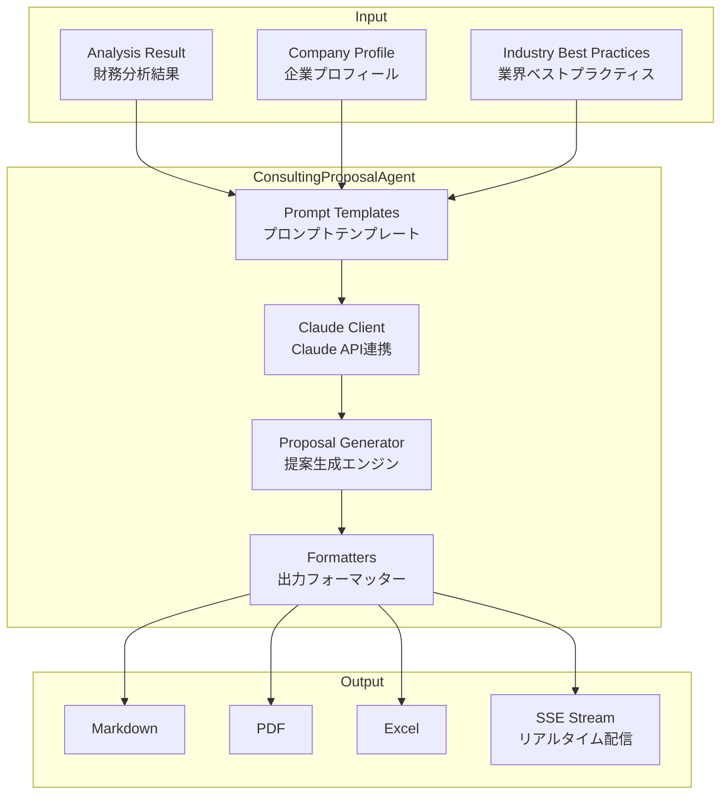
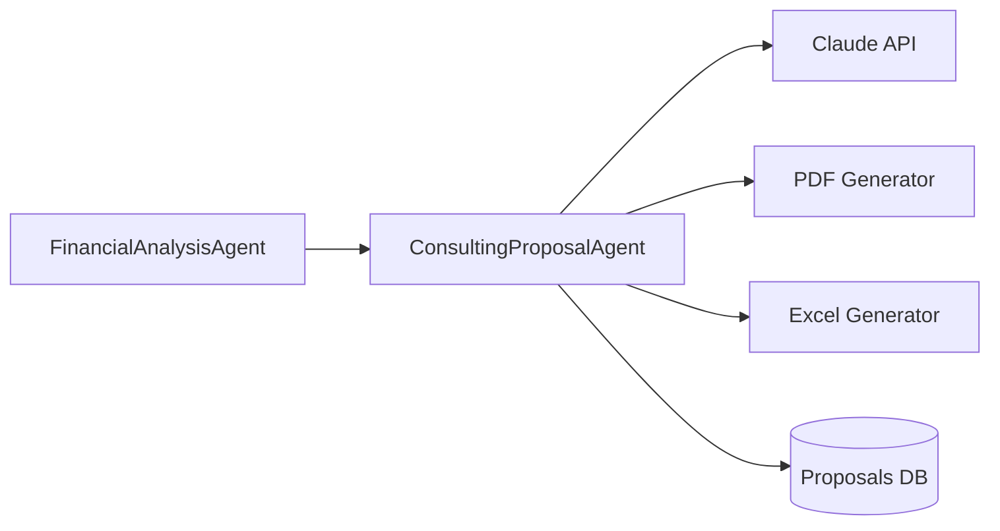

# ConsultingProposalAgent

AIを活用してコンサルティング提案を自動生成する専門エージェント

## 概要

| 項目 | 内容 |
|------|------|
| **名前** | ConsultingProposalAgent |
| **責任範囲** | 財務分析結果からコンサルティング提案を自動生成 |
| **トリガー** | 財務分析完了イベント（analysis.completed） |
| **出力** | 構造化されたコンサルティング提案書 |
| **AI Model** | Claude Sonnet 4 (claude-sonnet-4-20250514) |

## アーキテクチャ



## Claude API設定

### クライアント設定

```typescript
import Anthropic from '@anthropic-ai/sdk';

const client = new Anthropic({
  apiKey: process.env.ANTHROPIC_API_KEY,
});

const MODEL = 'claude-sonnet-4-20250514';
const MAX_TOKENS = 8192;
const TEMPERATURE = 0.7;
```

## プロンプトテンプレート

### システムプロンプト

```typescript
const SYSTEM_PROMPT = `あなたは、日本の中小企業を専門とする経営コンサルタントです。
「価値主義経営®」の原則に基づき、企業の財務データを分析し、
具体的で実行可能な改善提案を行います。

## あなたの専門性
- 20年以上の経営コンサルティング経験
- 1000社以上の中小企業支援実績
- 財務分析・経営改善・事業再生のスペシャリスト

## 価値主義経営®の6つの価値
1. 生産性価値：限られたリソースで最大の成果を出す
2. 財務価値：健全な財務体質を構築する
3. コスト価値：無駄を排除し効率を高める
4. リスク価値：リスクを適切に管理する
5. CSR価値：社会的責任を果たす
6. 付加価値：顧客に選ばれる独自の価値を創造する

## 提案の原則
- 具体的で実行可能な施策を提案する
- 優先順位を明確にする
- 期待効果を定量的に示す
- 実現に必要なリソースと期間を明示する
- リスクと対策を併記する`;
```

### 提案生成プロンプト

```typescript
interface ProposalPromptParams {
  companyName: string;
  industry: string;
  fiscalYear: string;
  analysisResult: AnalysisResult;
  companyProfile?: CompanyProfile;
}

function buildProposalPrompt(params: ProposalPromptParams): string {
  return `
# 経営改善提案書作成依頼

## 企業情報
- 企業名: ${params.companyName}
- 業種: ${params.industry}
- 対象期間: ${params.fiscalYear}

## 財務分析結果

### 収益性指標
${formatMetrics(params.analysisResult.profitability)}

### 安全性指標
${formatMetrics(params.analysisResult.safety)}

### 効率性指標
${formatMetrics(params.analysisResult.efficiency)}

### 成長性指標
${formatMetrics(params.analysisResult.growth)}

### キャッシュフロー分析
${formatCashFlow(params.analysisResult.cashFlow)}

### 業界ベンチマーク比較
${formatBenchmarks(params.analysisResult.benchmarks)}

### 検出された課題・アラート
${formatAnomalies(params.analysisResult.anomalies)}

## 作成してほしい提案書の構成

1. **エグゼクティブサマリー**（経営者向け要約、A4半ページ程度）

2. **財務分析の要点**
   - 強みTOP3
   - 課題TOP3
   - 業界内ポジション

3. **改善施策TOP3**（優先度順）
   各施策について以下を記載:
   - 施策名と概要
   - 期待効果（定量的に）
   - 必要リソース・投資額
   - 実施期間
   - リスクと対策
   - KPI（成功指標）

4. **中長期戦略提言**
   - 3年後のあるべき姿
   - そこに至るロードマップ
   - 必要な投資と期待リターン

5. **アクションプラン**
   - 今すぐ着手すべきこと（1ヶ月以内）
   - 短期で取り組むこと（3ヶ月以内）
   - 中期で取り組むこと（1年以内）

6. **補足資料**
   - 財務指標の詳細解説
   - 業界動向・競合分析
   - 参考事例

提案は具体的で実行可能なものにしてください。
数値目標は現実的な範囲で設定してください。
`;
}
```

## 提案生成パイプライン

```typescript
interface ProposalGenerationOptions {
  outputFormat: 'markdown' | 'pdf' | 'excel' | 'all';
  streaming: boolean;
  language: 'ja' | 'en';
}

async function* generateProposal(
  analysisResult: AnalysisResult,
  companyProfile: CompanyProfile,
  options: ProposalGenerationOptions = { outputFormat: 'markdown', streaming: true, language: 'ja' }
): AsyncGenerator<ProposalChunk> {
  // 1. プロンプト構築
  const prompt = buildProposalPrompt({
    companyName: companyProfile.name,
    industry: companyProfile.industry,
    fiscalYear: analysisResult.fiscalYear,
    analysisResult,
    companyProfile,
  });

  // 2. Claude APIでストリーミング生成
  if (options.streaming) {
    const stream = await client.messages.stream({
      model: MODEL,
      max_tokens: MAX_TOKENS,
      temperature: TEMPERATURE,
      system: SYSTEM_PROMPT,
      messages: [{ role: 'user', content: prompt }],
    });

    let fullContent = '';

    for await (const event of stream) {
      if (event.type === 'content_block_delta' && event.delta.type === 'text_delta') {
        const text = event.delta.text;
        fullContent += text;
        yield { type: 'text', content: text };
      }
    }

    // 3. 完了後にフォーマット変換
    if (options.outputFormat === 'pdf' || options.outputFormat === 'all') {
      const pdf = await convertToPdf(fullContent);
      yield { type: 'pdf', content: pdf };
    }

    if (options.outputFormat === 'excel' || options.outputFormat === 'all') {
      const excel = await convertToExcel(fullContent, analysisResult);
      yield { type: 'excel', content: excel };
    }
  } else {
    // 非ストリーミング
    const response = await client.messages.create({
      model: MODEL,
      max_tokens: MAX_TOKENS,
      temperature: TEMPERATURE,
      system: SYSTEM_PROMPT,
      messages: [{ role: 'user', content: prompt }],
    });

    const content = response.content[0].type === 'text' ? response.content[0].text : '';
    yield { type: 'markdown', content };
  }
}
```

## 提案書構造

```typescript
interface ConsultingProposal {
  id: string;
  analysisId: string;
  companyId: string;
  generatedAt: Date;
  version: string;

  // セクション
  executiveSummary: ExecutiveSummary;
  financialHighlights: FinancialHighlights;
  improvementMeasures: ImprovementMeasure[];
  longTermStrategy: LongTermStrategy;
  actionPlan: ActionPlan;
  appendix: Appendix;

  // メタデータ
  metadata: {
    model: string;
    promptVersion: string;
    generationTime: number;
    tokenUsage: TokenUsage;
  };
}

interface ExecutiveSummary {
  headline: string;           // 一言でまとめた見出し
  keyFindings: string[];      // 主要発見事項（3-5点）
  recommendation: string;     // 総合的な推奨
  expectedImpact: string;     // 期待される効果
}

interface FinancialHighlights {
  strengths: Highlight[];     // 強み TOP3
  weaknesses: Highlight[];    // 課題 TOP3
  industryPosition: string;   // 業界内ポジション
  overallScore: number;       // 総合スコア (0-100)
}

interface ImprovementMeasure {
  priority: number;           // 優先順位 (1-3)
  title: string;              // 施策名
  description: string;        // 概要
  expectedEffect: {
    quantitative: string;     // 定量効果（例: 営業利益+15%）
    qualitative: string;      // 定性効果
  };
  requiredResources: {
    budget: string;           // 必要予算
    personnel: string;        // 必要人員
    time: string;             // 必要期間
  };
  risks: Risk[];              // リスクと対策
  kpis: KPI[];                // 成功指標
}

interface LongTermStrategy {
  vision: string;             // 3年後のあるべき姿
  roadmap: RoadmapItem[];     // ロードマップ
  investment: {
    total: string;            // 総投資額
    breakdown: string[];      // 内訳
  };
  expectedRoi: string;        // 期待ROI
}

interface ActionPlan {
  immediate: Action[];        // 今すぐ（1ヶ月以内）
  shortTerm: Action[];        // 短期（3ヶ月以内）
  mediumTerm: Action[];       // 中期（1年以内）
}
```

## 出力フォーマッター

### Markdownフォーマッター

```typescript
function formatToMarkdown(proposal: ConsultingProposal): string {
  return `
# 経営改善提案書

**企業名**: ${proposal.companyName}
**作成日**: ${format(proposal.generatedAt, 'yyyy年MM月dd日')}
**対象期間**: ${proposal.fiscalYear}

---

## 1. エグゼクティブサマリー

### ${proposal.executiveSummary.headline}

${proposal.executiveSummary.keyFindings.map(f => `- ${f}`).join('\n')}

**推奨事項**: ${proposal.executiveSummary.recommendation}

**期待効果**: ${proposal.executiveSummary.expectedImpact}

---

## 2. 財務分析の要点

### 強み TOP3
${proposal.financialHighlights.strengths.map((s, i) => `${i + 1}. **${s.title}**: ${s.description}`).join('\n')}

### 課題 TOP3
${proposal.financialHighlights.weaknesses.map((w, i) => `${i + 1}. **${w.title}**: ${w.description}`).join('\n')}

### 業界内ポジション
${proposal.financialHighlights.industryPosition}

**総合スコア**: ${proposal.financialHighlights.overallScore}/100点

---

## 3. 改善施策 TOP3

${proposal.improvementMeasures.map(formatMeasure).join('\n\n---\n\n')}

---

## 4. 中長期戦略提言

### 3年後のあるべき姿
${proposal.longTermStrategy.vision}

### ロードマップ
${proposal.longTermStrategy.roadmap.map(formatRoadmapItem).join('\n')}

### 必要投資と期待リターン
- **総投資額**: ${proposal.longTermStrategy.investment.total}
- **期待ROI**: ${proposal.longTermStrategy.expectedRoi}

---

## 5. アクションプラン

### 今すぐ着手（1ヶ月以内）
${proposal.actionPlan.immediate.map(formatAction).join('\n')}

### 短期（3ヶ月以内）
${proposal.actionPlan.shortTerm.map(formatAction).join('\n')}

### 中期（1年以内）
${proposal.actionPlan.mediumTerm.map(formatAction).join('\n')}

---

## 6. 補足資料

${proposal.appendix.content}

---

*本提案書は財務データに基づくAI分析結果です。実施にあたっては専門家にご相談ください。*

**生成日時**: ${format(proposal.generatedAt, 'yyyy-MM-dd HH:mm:ss')}
**モデル**: ${proposal.metadata.model}
`;
}
```

### PDFフォーマッター

```typescript
import { jsPDF } from 'jspdf';
import 'jspdf-autotable';

async function convertToPdf(markdown: string): Promise<Buffer> {
  const doc = new jsPDF({
    orientation: 'portrait',
    unit: 'mm',
    format: 'a4',
  });

  // 日本語フォント設定
  doc.addFont('NotoSansJP-Regular.ttf', 'NotoSansJP', 'normal');
  doc.setFont('NotoSansJP');

  // Markdownをパースしてレンダリング
  const parsed = parseMarkdown(markdown);
  renderToPdf(doc, parsed);

  return Buffer.from(doc.output('arraybuffer'));
}
```

### Excelフォーマッター

```typescript
import ExcelJS from 'exceljs';

async function convertToExcel(
  markdown: string,
  analysisResult: AnalysisResult
): Promise<Buffer> {
  const workbook = new ExcelJS.Workbook();

  // シート1: エグゼクティブサマリー
  const summarySheet = workbook.addWorksheet('サマリー');
  // ...

  // シート2: 財務指標詳細
  const metricsSheet = workbook.addWorksheet('財務指標');
  addMetricsTable(metricsSheet, analysisResult);

  // シート3: 改善施策
  const measuresSheet = workbook.addWorksheet('改善施策');
  // ...

  // シート4: アクションプラン
  const actionSheet = workbook.addWorksheet('アクションプラン');
  // ...

  return Buffer.from(await workbook.xlsx.writeBuffer());
}
```

## Server-Sent Events (SSE)

```typescript
// リアルタイム配信エンドポイント
app.get('/api/v1/proposals/:id/stream', async (req, res) => {
  res.setHeader('Content-Type', 'text/event-stream');
  res.setHeader('Cache-Control', 'no-cache');
  res.setHeader('Connection', 'keep-alive');

  const analysisResult = await getAnalysisResult(req.params.id);
  const companyProfile = await getCompanyProfile(analysisResult.companyId);

  const generator = generateProposal(analysisResult, companyProfile, {
    outputFormat: 'markdown',
    streaming: true,
    language: 'ja',
  });

  for await (const chunk of generator) {
    res.write(`data: ${JSON.stringify(chunk)}\n\n`);
  }

  res.write('data: {"type": "done"}\n\n');
  res.end();
});
```

## メモリ管理

```typescript
// トークン使用量の監視
interface TokenUsage {
  inputTokens: number;
  outputTokens: number;
  totalTokens: number;
  estimatedCost: number;
}

function calculateCost(usage: TokenUsage): number {
  const INPUT_COST_PER_1K = 0.003;   // $3/1M tokens
  const OUTPUT_COST_PER_1K = 0.015;  // $15/1M tokens

  return (
    (usage.inputTokens / 1000) * INPUT_COST_PER_1K +
    (usage.outputTokens / 1000) * OUTPUT_COST_PER_1K
  );
}

// レート制限
const rateLimiter = new RateLimiter({
  tokensPerMinute: 100000,
  requestsPerMinute: 60,
});
```

## エラーハンドリング

```typescript
class ProposalGenerationError extends Error {
  constructor(
    message: string,
    public code: string,
    public retryable: boolean
  ) {
    super(message);
    this.name = 'ProposalGenerationError';
  }
}

async function generateWithRetry(
  analysisResult: AnalysisResult,
  companyProfile: CompanyProfile,
  maxRetries: number = 3
): Promise<ConsultingProposal> {
  let lastError: Error;

  for (let attempt = 1; attempt <= maxRetries; attempt++) {
    try {
      return await generateProposalSync(analysisResult, companyProfile);
    } catch (error) {
      lastError = error;

      if (error instanceof Anthropic.RateLimitError) {
        // レート制限: 指数バックオフ
        await sleep(Math.pow(2, attempt) * 1000);
        continue;
      }

      if (error instanceof Anthropic.APIError && error.status >= 500) {
        // サーバーエラー: リトライ
        await sleep(attempt * 1000);
        continue;
      }

      // その他のエラー: 即座に失敗
      throw error;
    }
  }

  throw new ProposalGenerationError(
    `Failed after ${maxRetries} attempts: ${lastError.message}`,
    'MAX_RETRIES_EXCEEDED',
    false
  );
}
```

## イベント発行

```typescript
interface ProposalCompletedEvent {
  type: 'proposal.completed';
  payload: {
    proposalId: string;
    analysisId: string;
    companyId: string;
    format: string[];
    generationTime: number;
    tokenUsage: TokenUsage;
  };
}

// 完了通知
eventBus.emit('proposal.completed', {
  proposalId: proposal.id,
  analysisId: proposal.analysisId,
  companyId: proposal.companyId,
  format: ['markdown', 'pdf'],
  generationTime: elapsedMs,
  tokenUsage: proposal.metadata.tokenUsage,
});
```

## テスト要件

| テスト種別 | カバレッジ目標 | 内容 |
|-----------|---------------|------|
| 単体テスト | 80%+ | プロンプト構築、フォーマッター |
| 統合テスト | - | Claude API連携 |
| モックテスト | - | API応答のモック |
| 出力検証 | - | 提案書品質チェック |

```typescript
// テスト用モック
jest.mock('@anthropic-ai/sdk', () => ({
  Anthropic: jest.fn().mockImplementation(() => ({
    messages: {
      create: jest.fn().mockResolvedValue({
        content: [{ type: 'text', text: mockProposalContent }],
        usage: { input_tokens: 1000, output_tokens: 2000 },
      }),
    },
  })),
}));
```

## 設定

```yaml
# config/agents/consulting-proposal.yaml
agent:
  name: ConsultingProposalAgent
  version: 1.0.0

claude:
  model: claude-sonnet-4-20250514
  max_tokens: 8192
  temperature: 0.7

output:
  formats:
    - markdown
    - pdf
    - excel
  streaming: true
  language: ja

rate_limit:
  tokens_per_minute: 100000
  requests_per_minute: 60

retry:
  max_attempts: 3
  backoff_base: 2

monitoring:
  log_prompts: false  # 本番ではfalse
  track_token_usage: true
  alert_on_high_cost: true
  cost_threshold_daily: 100  # $100/day
```

## 依存関係



---

**Author**: Miyabi Framework
**Version**: 1.0.0
**Last Updated**: 2024-12
