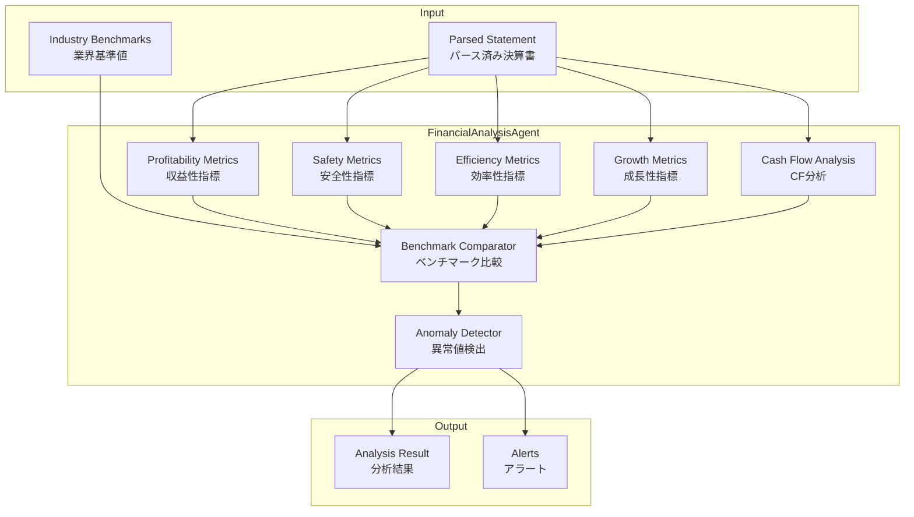
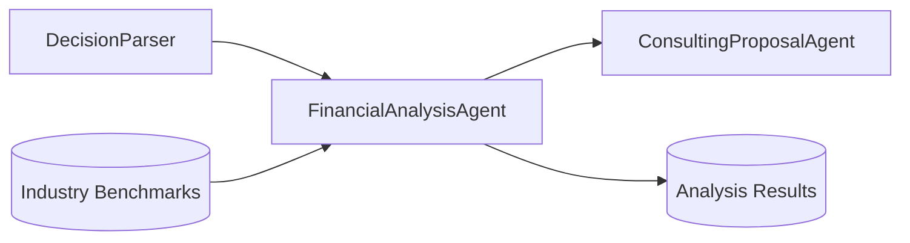

# FinancialAnalysisAgent

財務分析を自動実行する専門エージェント

## 概要

| 項目 | 内容 |
|------|------|
| **名前** | FinancialAnalysisAgent |
| **責任範囲** | 決算書データの財務指標計算・分析・ベンチマーク比較 |
| **トリガー** | 決算書パース完了イベント |
| **出力** | 構造化された財務分析結果 |

## アーキテクチャ



## 分析指標

### 1. 収益性指標 (Profitability Metrics)

| 指標 | 計算式 | 判定基準 |
|------|--------|----------|
| ROE（自己資本利益率） | 当期純利益 / 自己資本 × 100 | 8%以上: 良好 |
| ROA（総資産利益率） | 当期純利益 / 総資産 × 100 | 5%以上: 良好 |
| 営業利益率 | 営業利益 / 売上高 × 100 | 業界平均比較 |
| 売上総利益率 | 売上総利益 / 売上高 × 100 | 業界平均比較 |
| 経常利益率 | 経常利益 / 売上高 × 100 | 5%以上: 良好 |
| 当期純利益率 | 当期純利益 / 売上高 × 100 | 3%以上: 良好 |

### 2. 安全性指標 (Safety Metrics)

| 指標 | 計算式 | 判定基準 |
|------|--------|----------|
| 自己資本比率 | 自己資本 / 総資産 × 100 | 40%以上: 良好 |
| 流動比率 | 流動資産 / 流動負債 × 100 | 200%以上: 良好 |
| 当座比率 | 当座資産 / 流動負債 × 100 | 100%以上: 良好 |
| 固定長期適合率 | 固定資産 / (自己資本 + 固定負債) × 100 | 100%以下: 良好 |
| 負債比率 | 負債 / 自己資本 × 100 | 100%以下: 良好 |
| インタレスト・カバレッジ | 営業利益 / 支払利息 | 3倍以上: 良好 |

### 3. 効率性指標 (Efficiency Metrics)

| 指標 | 計算式 | 判定基準 |
|------|--------|----------|
| 総資産回転率 | 売上高 / 総資産 | 1.0以上: 良好 |
| 売上債権回転率 | 売上高 / 売上債権 | 高いほど良好 |
| 棚卸資産回転率 | 売上原価 / 棚卸資産 | 高いほど良好 |
| 仕入債務回転率 | 売上原価 / 仕入債務 | 適切なバランス |
| 固定資産回転率 | 売上高 / 固定資産 | 高いほど良好 |

### 4. 成長性指標 (Growth Metrics)

| 指標 | 計算式 | 判定基準 |
|------|--------|----------|
| 売上高成長率 | (当期売上 - 前期売上) / 前期売上 × 100 | プラス: 成長 |
| 営業利益成長率 | (当期営業利益 - 前期営業利益) / 前期営業利益 × 100 | プラス: 成長 |
| 経常利益成長率 | (当期経常利益 - 前期経常利益) / 前期経常利益 × 100 | プラス: 成長 |
| 総資産成長率 | (当期総資産 - 前期総資産) / 前期総資産 × 100 | 適切な成長 |
| 従業員数成長率 | (当期従業員 - 前期従業員) / 前期従業員 × 100 | 事業拡大指標 |

### 5. キャッシュフロー分析

| 指標 | 計算式 | 判定基準 |
|------|--------|----------|
| 営業CF | 営業活動によるCF | プラス: 良好 |
| 投資CF | 投資活動によるCF | 成長投資確認 |
| 財務CF | 財務活動によるCF | 資金調達状況 |
| フリーCF | 営業CF + 投資CF | プラス: 良好 |
| CFマージン | 営業CF / 売上高 × 100 | 高いほど良好 |

## CFパターン判定

```typescript
type CFPattern =
  | 'healthy_growth'      // 営業+, 投資-, 財務-: 健全な成長
  | 'aggressive_growth'   // 営業+, 投資-, 財務+: 積極的成長
  | 'stable'              // 営業+, 投資-, 財務0: 安定経営
  | 'restructuring'       // 営業-, 投資+, 財務-: リストラ中
  | 'crisis'              // 営業-, 投資-, 財務+: 資金繰り危機
  | 'declining'           // 営業-, 投資+, 財務+: 衰退期
```

## 業界ベンチマーク比較

### パーセンタイル順位

```typescript
interface BenchmarkResult {
  industryCode: string;          // 業種コード
  industryName: string;          // 業種名
  sampleSize: number;            // サンプル数
  percentile: number;            // パーセンタイル順位 (0-100)
  quartile: 'Q1' | 'Q2' | 'Q3' | 'Q4';  // 四分位
  industryAverage: number;       // 業界平均
  industryMedian: number;        // 業界中央値
  deviation: number;             // 偏差
  rating: 'excellent' | 'good' | 'average' | 'below_average' | 'poor';
}
```

### 判定基準

| パーセンタイル | 四分位 | 評価 |
|---------------|--------|------|
| 75-100 | Q4 | excellent（優秀） |
| 50-75 | Q3 | good（良好） |
| 25-50 | Q2 | average（平均） |
| 10-25 | Q1 | below_average（平均以下） |
| 0-10 | Q1 | poor（要改善） |

## 異常値検出

### 検出ルール

```typescript
interface AnomalyRule {
  metric: string;           // 対象指標
  condition: 'threshold' | 'deviation' | 'trend';
  threshold?: number;       // 閾値
  deviationMultiplier?: number;  // 標準偏差の倍数
  severity: 'critical' | 'warning' | 'info';
  message: string;
}

const anomalyRules: AnomalyRule[] = [
  {
    metric: 'current_ratio',
    condition: 'threshold',
    threshold: 100,
    severity: 'critical',
    message: '流動比率が100%を下回っています。短期的な支払能力に懸念があります。'
  },
  {
    metric: 'equity_ratio',
    condition: 'threshold',
    threshold: 20,
    severity: 'critical',
    message: '自己資本比率が20%を下回っています。財務安全性に懸念があります。'
  },
  {
    metric: 'operating_cf',
    condition: 'threshold',
    threshold: 0,
    severity: 'warning',
    message: '営業キャッシュフローがマイナスです。本業での資金創出力を確認してください。'
  },
  {
    metric: 'roe',
    condition: 'deviation',
    deviationMultiplier: 2,
    severity: 'info',
    message: 'ROEが業界平均から大きく乖離しています。'
  }
];
```

## 出力フォーマット

### AnalysisResult

```typescript
interface AnalysisResult {
  id: string;
  statementId: string;
  analyzedAt: Date;

  // 指標別結果
  profitability: MetricResult[];
  safety: MetricResult[];
  efficiency: MetricResult[];
  growth: MetricResult[];
  cashFlow: CashFlowResult;

  // ベンチマーク比較
  benchmarks: BenchmarkResult[];

  // 異常値・アラート
  anomalies: Anomaly[];

  // サマリー
  summary: {
    overallScore: number;        // 総合スコア (0-100)
    strengths: string[];         // 強み
    weaknesses: string[];        // 弱み
    recommendations: string[];   // 推奨事項
  };
}

interface MetricResult {
  name: string;
  value: number;
  unit: string;
  benchmark: BenchmarkResult;
  trend: 'up' | 'down' | 'stable';
  status: 'excellent' | 'good' | 'average' | 'below_average' | 'poor';
}
```

## 並列処理設計

```typescript
// メモリ効率を考慮した並列処理
const PARALLEL_LIMIT = 8;

async function analyzeStatement(statement: ParsedStatement): Promise<AnalysisResult> {
  const pool = new WorkerPool(PARALLEL_LIMIT);

  // 独立した指標計算を並列実行
  const [profitability, safety, efficiency, growth, cashFlow] = await Promise.all([
    pool.execute(() => calculateProfitability(statement)),
    pool.execute(() => calculateSafety(statement)),
    pool.execute(() => calculateEfficiency(statement)),
    pool.execute(() => calculateGrowth(statement)),
    pool.execute(() => analyzeCashFlow(statement)),
  ]);

  // ベンチマーク比較（DB参照が必要なため逐次）
  const benchmarks = await compareBenchmarks({
    profitability,
    safety,
    efficiency,
    growth,
  });

  // 異常値検出
  const anomalies = detectAnomalies({
    profitability,
    safety,
    efficiency,
    growth,
    cashFlow,
    benchmarks,
  });

  return {
    profitability,
    safety,
    efficiency,
    growth,
    cashFlow,
    benchmarks,
    anomalies,
    summary: generateSummary(anomalies, benchmarks),
  };
}
```

## メモリ管理

```typescript
// メモリ使用量監視
const MEMORY_THRESHOLD = 0.92; // 92%

function checkMemoryUsage(): boolean {
  const usage = process.memoryUsage();
  const heapUsedRatio = usage.heapUsed / usage.heapTotal;
  return heapUsedRatio < MEMORY_THRESHOLD;
}

// バックプレッシャー制御
async function analyzeWithBackpressure(
  statements: ParsedStatement[]
): AsyncGenerator<AnalysisResult> {
  for (const statement of statements) {
    // メモリチェック
    while (!checkMemoryUsage()) {
      await new Promise(resolve => setTimeout(resolve, 100));
      global.gc?.(); // 強制GC
    }

    yield await analyzeStatement(statement);
  }
}
```

## イベント発行

```typescript
// 分析完了時にイベント発行
interface AnalysisCompletedEvent {
  type: 'analysis.completed';
  payload: {
    analysisId: string;
    statementId: string;
    companyId: string;
    summary: AnalysisSummary;
    hasAlerts: boolean;
    alertCount: number;
  };
}

// ConsultingProposalAgentへのトリガー
eventBus.emit('analysis.completed', {
  analysisId: result.id,
  statementId: result.statementId,
  companyId: statement.companyId,
  summary: result.summary,
  hasAlerts: result.anomalies.length > 0,
  alertCount: result.anomalies.length,
});
```

## テスト要件

| テスト種別 | カバレッジ目標 | 内容 |
|-----------|---------------|------|
| 単体テスト | 80%+ | 各指標計算ロジック |
| 統合テスト | - | ベンチマーク比較フロー |
| 境界値テスト | - | ゼロ除算、マイナス値 |
| 性能テスト | - | 100件/分の処理能力 |

## 依存関係



## 設定

```yaml
# config/agents/financial-analysis.yaml
agent:
  name: FinancialAnalysisAgent
  version: 1.0.0

execution:
  parallel_limit: 8
  memory_threshold: 0.92
  timeout_seconds: 120

metrics:
  profitability:
    enabled: true
    include: [roe, roa, operating_margin, gross_margin]
  safety:
    enabled: true
    include: [equity_ratio, current_ratio, quick_ratio]
  efficiency:
    enabled: true
    include: [asset_turnover, receivable_turnover, inventory_turnover]
  growth:
    enabled: true
    include: [revenue_growth, profit_growth]
  cash_flow:
    enabled: true

benchmark:
  enabled: true
  data_source: industry_benchmarks
  comparison_method: percentile

anomaly_detection:
  enabled: true
  rules_path: config/anomaly-rules.yaml
```

---

**Author**: Miyabi Framework
**Version**: 1.0.0
**Last Updated**: 2024-12
