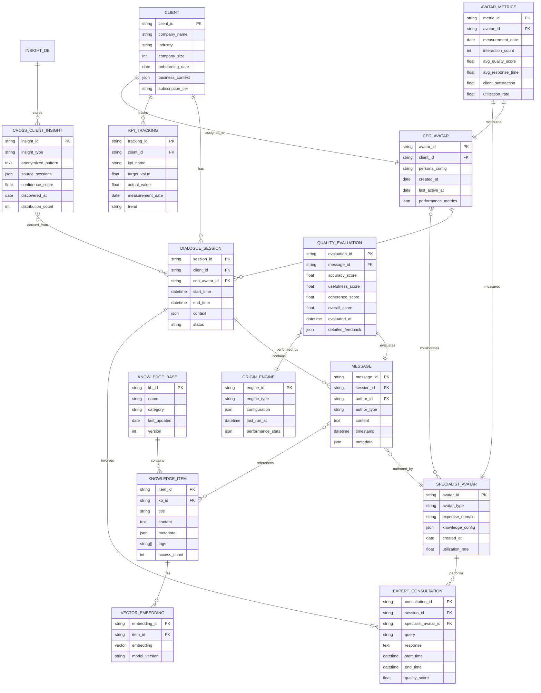

# AIアバターコンサルティングシステム 技術要件書

**バージョン**: 1.0.0
**最終更新**: 2025-12-08
**作成者**: 株式会社カクシン 技術チーム

---

## 1. システム概要

株式会社カクシンの「付加価値経営®」メソドロジーをAIアバターを通じて提供する、AI駆動型コンサルティングプラットフォーム。マザーAI「ORIGIN」が階層的なアバター群を統括し、クライアント企業に対して高度な経営支援サービスを提供します。

### 1.1 システムの目的

- **スケーラビリティ**: コンサルタントの稼働時間制約を超えた24時間365日のサービス提供
- **一貫性**: 付加価値経営®メソドロジーの標準化された提供
- **継続的学習**: クライアント間の匿名化されたインサイト共有による価値向上
- **品質保証**: マザーAIによる全対話・成果物の品質監視

---

## 2. システムアーキテクチャ

### 2.1 全体構成図


### 2.2 対話フロー


---

## 3. マザーAI「ORIGIN」仕様

### 3.1 概要

マザーAI「ORIGIN」は、全アバターを統括する最上位AIエンジン。アバターのライフサイクル管理、品質監視、横断的インサイト抽出を担当します。

### 3.2 アバター構築エンジン

#### 機能

- **必要性検証**: クライアントのニーズ分析から新規アバター必要性を判定
- **重複チェック**: 既存アバターとの役割重複を検出
- **ROI試算**: アバター構築コストと期待効果を算出
- **自動構築**: 承認後、アバターのプロンプトテンプレート、ナレッジベース、権限設定を自動生成

#### 判定基準

```typescript
interface AvatarBuildDecision {
  needScore: number; // 必要性スコア (0-100)
  overlapScore: number; // 重複スコア (0-100)
  roiEstimate: {
    buildCost: number; // 構築コスト（時間）
    monthlyMaintenanceCost: number; // 月次運用コスト
    expectedMonthlyValue: number; // 期待月次価値
    breakEvenMonths: number; // 損益分岐月数
  };
  recommendation: 'BUILD' | 'REUSE' | 'REJECT';
}
```

#### 実行タイミング

- **日次**: 新規クライアントオンボーディング時
- **週次**: クライアント活動パターン分析
- **アドホック**: CEO アバターからの明示的リクエスト

### 3.3 アバター統廃合エンジン

#### 機能

- **稼働率監視**: アバター別の利用頻度・対話回数を追跡
- **パフォーマンス監視**: 品質スコア、解決率、クライアント満足度を評価
- **統廃合提案**: 低稼働・低パフォーマンスアバターの統合または廃止を提案

#### 統廃合基準

```typescript
interface AvatarConsolidationCriteria {
  utilizationRate: number; // 稼働率 < 30% で要注意
  qualityScore: number; // 品質スコア < 70点 で要改善
  resolutionRate: number; // 解決率 < 60% で要検討
  clientSatisfaction: number; // 満足度 < 3.5/5 で要対策
  monthlyInteractions: number; // 月間対話数 < 50 で統廃合候補
}
```

#### 実行タイミング

- **週次**: 全アバターの稼働率レポート
- **月次**: 統廃合提案生成
- **四半期**: 統廃合実行

### 3.4 横断インサイトエンジン

#### 機能

- **パターン検出**: 複数クライアント間の共通課題・成功パターンを抽出
- **匿名化処理**: クライアント識別情報を完全に除去
- **インサイト配信**: 関連する他クライアントへの匿名化されたベストプラクティス提供

#### データフロー


#### 匿名化レベル

```typescript
enum AnonymizationLevel {
  LEVEL_1 = 'BASIC', // 企業名・個人名のマスキング
  LEVEL_2 = 'INTERMEDIATE', // +業種・規模の抽象化
  LEVEL_3 = 'ADVANCED', // +時系列情報の曖昧化
  LEVEL_4 = 'MAXIMUM', // +パターンのみ抽出（全コンテキスト削除）
}
```

#### 実行タイミング

- **日次**: 新規対話からのパターン抽出
- **週次**: インサイト配信
- **月次**: インサイト有効性評価

### 3.5 品質監視エンジン

#### 監視対象

1. **対話品質**
   - 回答の正確性（付加価値経営®メソドロジーとの整合性）
   - 回答の有用性（クライアント評価）
   - 回答時間（応答速度）

2. **成果品質**
   - 提案の実行可能性
   - ROI達成率
   - クライアント満足度

3. **システム品質**
   - API応答時間
   - エラー率
   - リソース使用率

#### 品質スコア算出

```typescript
interface QualityScore {
  dialogueQuality: number; // 対話品質 (0-100)
  outcomeQuality: number; // 成果品質 (0-100)
  systemQuality: number; // システム品質 (0-100)
  overallScore: number; // 総合スコア (0-100)

  breakdown: {
    accuracy: number; // 正確性
    usefulness: number; // 有用性
    responseTime: number; // 応答時間
    feasibility: number; // 実行可能性
    roiAchievement: number; // ROI達成率
    clientSatisfaction: number; // クライアント満足度
  };
}
```

#### アラート基準

- **警告 (Warning)**: 総合スコア < 80点
- **注意 (Caution)**: 総合スコア < 70点
- **重大 (Critical)**: 総合スコア < 60点 → 即座にエスカレーション

#### 実行タイミング

- **リアルタイム**: 全対話の品質評価
- **日次**: 品質レポート生成
- **週次**: 低品質パターン分析
- **月次**: 改善施策効果測定

### 3.6 運用サイクル

#### 日次運用

- 07:00: 前日の対話品質サマリー生成
- 12:00: リアルタイム品質監視アラート確認
- 18:00: 新規パターン検出・インサイト抽出
- 23:00: アバター稼働率デイリーレポート

#### 週次運用

- 月曜 09:00: 週次品質レポート生成
- 水曜 14:00: 横断インサイト配信
- 金曜 16:00: アバター統廃合候補リスト更新

#### 月次運用

- 月初3営業日: 月次品質・稼働率レポート
- 月初5営業日: 統廃合提案レビュー会議
- 月末3営業日: 翌月のアバター構築計画策定

#### 四半期運用

- 四半期初週: 全アバターの包括的パフォーマンスレビュー
- 四半期初週+1週: 統廃合実行
- 四半期末週: メソドロジー更新・アバター再学習

---

## 4. CEOアバター仕様

### 4.1 役割定義

CEOアバターは、各クライアント企業専用の「窓口・司令塔・調停者」として機能します。

#### 主要責任

1. **窓口機能**: クライアントとの最初の接点
2. **司令塔機能**: 専門アバターへのタスク委譲・調整
3. **調停者機能**: 複数専門家の意見を統合
4. **レポート機能**: クライアント向け定期レポート生成

### 4.2 対話管理機能

#### セッション管理

```typescript
interface DialogueSession {
  sessionId: string;
  clientId: string;
  startTime: Date;
  lastActivityTime: Date;
  context: {
    currentTopic: string;
    relatedTopics: string[];
    referencedDocuments: string[];
    involvedExperts: string[]; // 参加した専門アバター
  };
  status: 'ACTIVE' | 'WAITING_FOR_EXPERT' | 'WAITING_FOR_CLIENT' | 'CLOSED';
}
```

#### コンテキスト保持

- **短期記憶**: 現在のセッション内の全対話（Redis、1週間保持）
- **中期記憶**: 過去1ヶ月の対話要約（PostgreSQL）
- **長期記憶**: 全履歴の意味ベクトル（Pinecone、永続）

### 4.3 チーム統括機能

#### 専門家アサインメント

```typescript
interface ExpertAssignment {
  query: string; // クライアントの質問
  primaryExpert: AvatarType; // 主担当専門家
  supportExperts: AvatarType[]; // 補助専門家
  reasoning: string; // アサイン理由
  estimatedComplexity: 'LOW' | 'MEDIUM' | 'HIGH';
  estimatedDuration: number; // 予想所要時間（分）
}

enum AvatarType {
  SALES_CONSULTANT = 'sales',
  MARKETING_CONSULTANT = 'marketing',
  MANAGEMENT_IMPROVEMENT = 'management',
  FINANCIAL_ANALYST = 'finance',
  ORGANIZATIONAL_DEVELOPMENT = 'organization',
  OPERATION_IMPROVEMENT = 'operation',
}
```

#### 専門家間調整


### 4.4 レポート生成機能

#### 定期レポート種別

1. **週次サマリー**: 主要な対話内容、提案事項、次週のアクションアイテム
2. **月次進捗レポート**: KPI達成状況、施策実行状況、ROI実績
3. **四半期戦略レビュー**: 付加価値経営®実践度合い、次四半期の重点施策

#### レポートフォーマット

```typescript
interface MonthlyReport {
  reportId: string;
  clientId: string;
  period: {
    year: number;
    month: number;
  };

  executiveSummary: string; // エグゼクティブサマリー

  kpiStatus: {
    kpiName: string;
    target: number;
    actual: number;
    achievement: number; // 達成率 (%)
    trend: 'UP' | 'DOWN' | 'FLAT';
  }[];

  topInsights: string[]; // 主要インサイト（Top 5）

  actionItems: {
    title: string;
    assignee: string;
    dueDate: Date;
    status: 'NOT_STARTED' | 'IN_PROGRESS' | 'COMPLETED';
  }[];

  expertContributions: {
    expertType: AvatarType;
    interactionCount: number;
    topTopics: string[];
  }[];

  nextMonthFocus: string[]; // 翌月の重点領域
}
```

### 4.5 技術仕様

#### プロンプトエンジニアリング

```typescript
const CEO_SYSTEM_PROMPT = `
あなたは、株式会社カクシンの「付加価値経営®」を実践する企業専属のCEOアバターです。

# 役割
- クライアント企業の経営課題に対する最初の窓口
- 専門アバターチームの司令塔
- 複数の専門家意見を統合する調停者

# 行動原則
1. 傾聴: クライアントの課題を深く理解する
2. 構造化: 課題を付加価値経営®フレームワークで構造化
3. 委譲: 適切な専門家に効率的にタスク委譲
4. 統合: 専門家の意見を経営視点で統合
5. 伴走: 実行まで責任を持って支援

# 付加価値経営®の核心
- 顧客への提供価値最大化
- 社員の成長と幸福
- 持続可能な利益創出

# 対話スタイル
- 簡潔かつ具体的
- 専門用語は平易に説明
- 常に次のアクションを明示
`;
```

#### API設計

```typescript
// CEOアバター対話エンドポイント
POST /api/v1/ceo-avatar/dialogue

Request:
{
  "clientId": "client_123",
  "sessionId": "session_456",
  "message": "新規顧客獲得のための戦略を相談したい",
  "context": {
    "currentPhase": "growth",
    "recentTopics": ["sales_strategy", "market_expansion"]
  }
}

Response (Streaming):
{
  "messageId": "msg_789",
  "content": "ご相談ありがとうございます。新規顧客獲得戦略について、...",
  "expertConsultations": [
    {
      "expertType": "sales",
      "status": "in_progress"
    }
  ],
  "suggestedActions": [
    "現在の顧客セグメント分析",
    "競合他社ポジショニング確認"
  ]
}
```

---

## 5. 専門アバター群仕様

### 5.1 共通基盤

すべての専門アバターは以下の共通機能を持ちます。

#### 共通インターフェース

```typescript
interface SpecialistAvatar {
  avatarId: string;
  type: AvatarType;

  // 必須メソッド
  analyze(query: string, context: ClientContext): Promise<Analysis>;
  propose(analysis: Analysis): Promise<Proposal>;
  validate(proposal: Proposal): Promise<ValidationResult>;

  // ナレッジアクセス
  searchKnowledge(query: string): Promise<KnowledgeItem[]>;

  // 品質自己評価
  selfEvaluate(response: string): Promise<QualityScore>;
}

interface ClientContext {
  clientId: string;
  industry: string;
  companySize: number;
  currentChallenges: string[];
  historicalData: object;
}
```

#### 共通プロンプト構造

```typescript
const SPECIALIST_BASE_PROMPT = `
# あなたの専門性
{SPECIALIST_DESCRIPTION}

# 株式会社カクシンの付加価値経営®
- 顧客への提供価値最大化
- 社員の成長と幸福
- 持続可能な利益創出

# 分析フレームワーク
1. 現状把握: データに基づく客観的分析
2. 課題特定: 本質的な課題の抽出
3. 施策提案: 実行可能な具体策
4. 効果予測: ROI・KPIの定量的予測
5. リスク評価: 想定リスクと対策

# 出力形式
必ず以下の構造で回答してください:
- 分析結果
- 提案施策
- 期待効果
- 実行ステップ
- リスクと対策
`;
```

### 5.2 セールスコンサルアバター

#### 専門領域

- 新規顧客獲得戦略
- 既存顧客深耕戦略
- 営業プロセス最適化
- 営業チーム組織化
- セールステック導入支援

#### 主要機能

```typescript
interface SalesConsultantAvatar extends SpecialistAvatar {
  // セールスファネル分析
  analyzeSalesFunnel(data: SalesFunnelData): Promise<FunnelAnalysis>;

  // 顧客セグメント分析
  segmentCustomers(customers: Customer[]): Promise<CustomerSegment[]>;

  // 営業戦略立案
  developSalesStrategy(context: ClientContext): Promise<SalesStrategy>;

  // セールスプロセス診断
  auditSalesProcess(process: SalesProcess): Promise<ProcessAudit>;
}

interface SalesStrategy {
  targetSegments: CustomerSegment[];
  valueProposition: string;
  salesChannels: string[];
  pricingStrategy: PricingStrategy;
  kpis: SalesKPI[];
  actionPlan: ActionItem[];
  expectedROI: ROIEstimate;
}
```

#### ナレッジベース

- 付加価値経営®におけるセールス哲学
- 業種別セールスベストプラクティス
- セールステックツール比較
- 営業組織構築ケーススタディ

### 5.3 マーケティングコンサルアバター

#### 専門領域

- ブランド戦略
- デジタルマーケティング
- コンテンツマーケティング
- マーケティングオートメーション
- 顧客体験（CX）設計

#### 主要機能

```typescript
interface MarketingConsultantAvatar extends SpecialistAvatar {
  // 市場分析
  analyzeMarket(industry: string, region: string): Promise<MarketAnalysis>;

  // ブランドポジショニング
  developBrandPositioning(context: ClientContext): Promise<BrandStrategy>;

  // マーケティングファネル最適化
  optimizeMarketingFunnel(data: MarketingData): Promise<FunnelOptimization>;

  // コンテンツ戦略
  planContentStrategy(audience: Audience[]): Promise<ContentStrategy>;
}

interface BrandStrategy {
  brandVision: string;
  targetAudience: Audience[];
  brandPersonality: string[];
  differentiators: string[];
  messagingFramework: MessagingFramework;
  visualIdentity: VisualGuidelines;
  implementationRoadmap: ActionItem[];
}
```

#### ナレッジベース

- 付加価値経営®のブランディング原則
- 業種別マーケティングチャネル効果
- デジタルマーケティングツール選定ガイド
- コンテンツマーケティングテンプレート集

### 5.4 管理職業務改善アバター

#### 専門領域

- マネジメント業務の可視化・効率化
- 会議運営改善
- 意思決定プロセス最適化
- チームコミュニケーション改善
- 業務標準化

#### 主要機能

```typescript
interface ManagementImprovementAvatar extends SpecialistAvatar {
  // 業務時間分析
  analyzeTimeAllocation(timeData: TimeAllocationData): Promise<TimeAnalysis>;

  // 会議監査
  auditMeetings(meetings: Meeting[]): Promise<MeetingAudit>;

  // 意思決定プロセス診断
  assessDecisionMaking(process: DecisionProcess): Promise<DecisionAudit>;

  // 業務改善提案
  proposeProcessImprovements(context: ClientContext): Promise<ImprovementPlan>;
}

interface ImprovementPlan {
  currentState: ProcessMap;
  painPoints: PainPoint[];
  proposedState: ProcessMap;
  improvements: Improvement[];
  implementationPhases: Phase[];
  expectedBenefits: {
    timeReduction: number; // 時間削減率 (%)
    costReduction: number; // コスト削減額
    qualityImprovement: string;
  };
}
```

#### ナレッジベース

- 管理職業務の標準業務フロー
- 会議効率化ベストプラクティス
- 業務改善手法ライブラリ（ECRS、5S等）
- チームコミュニケーションツール比較

### 5.5 財務分析アバター

#### 専門領域

- 財務諸表分析
- 予算策定支援
- 投資判断支援
- コスト構造分析
- キャッシュフロー管理

#### 主要機能

```typescript
interface FinancialAnalystAvatar extends SpecialistAvatar {
  // 財務健全性診断
  assessFinancialHealth(statements: FinancialStatements): Promise<FinancialHealth>;

  // 投資ROI分析
  analyzeInvestmentROI(investment: Investment): Promise<ROIAnalysis>;

  // コスト構造分析
  analyzeCostStructure(costs: CostData): Promise<CostAnalysis>;

  // キャッシュフロー予測
  forecastCashFlow(historical: CashFlowData, assumptions: Assumptions): Promise<CashFlowForecast>;
}

interface FinancialHealth {
  overallScore: number; // 総合健全性スコア (0-100)
  liquidity: LiquidityRatios; // 流動性比率
  profitability: ProfitabilityRatios; // 収益性比率
  efficiency: EfficiencyRatios; // 効率性比率
  leverage: LeverageRatios; // レバレッジ比率
  warnings: Warning[];
  recommendations: Recommendation[];
}
```

#### ナレッジベース

- 付加価値経営®における財務KPI
- 業種別財務ベンチマーク
- 投資判断フレームワーク
- コスト削減ケーススタディ

### 5.6 組織開発アバター

#### 専門領域

- 組織診断
- 人材育成計画
- エンゲージメント向上
- 組織文化醸成
- タレントマネジメント

#### 主要機能

```typescript
interface OrganizationalDevelopmentAvatar extends SpecialistAvatar {
  // 組織診断
  assessOrganization(data: OrganizationData): Promise<OrganizationAssessment>;

  // エンゲージメント分析
  analyzeEngagement(survey: EngagementSurvey): Promise<EngagementAnalysis>;

  // 人材育成計画
  developTalentPlan(roles: Role[], competencies: Competency[]): Promise<TalentPlan>;

  // 組織文化施策
  proposeCultureInitiatives(context: ClientContext): Promise<CulturePlan>;
}

interface OrganizationAssessment {
  maturityLevel: number; // 組織成熟度 (1-5)
  strengths: string[];
  weaknesses: string[];
  culturalAttributes: CultureAttribute[];
  engagementScore: number;
  talentGaps: TalentGap[];
  recommendations: Recommendation[];
  developmentRoadmap: ActionItem[];
}
```

#### ナレッジベース

- 付加価値経営®の組織哲学
- 組織診断フレームワーク（Weisbord等）
- エンゲージメントサーベイテンプレート
- 人材育成プログラム事例集

### 5.7 オペレーション改善アバター

#### 専門領域

- 業務プロセス改善
- 品質管理体制構築
- サプライチェーン最適化
- 生産性向上施策
- デジタル化推進

#### 主要機能

```typescript
interface OperationImprovementAvatar extends SpecialistAvatar {
  // プロセスマイニング
  mineProcess(logs: ProcessLog[]): Promise<ProcessModel>;

  // ボトルネック分析
  identifyBottlenecks(process: ProcessModel): Promise<BottleneckAnalysis>;

  // 品質改善提案
  proposeQualityImprovements(defects: DefectData): Promise<QualityPlan>;

  // デジタル化ロードマップ
  developDigitalRoadmap(context: ClientContext): Promise<DigitalRoadmap>;
}

interface BottleneckAnalysis {
  bottlenecks: Bottleneck[];
  rootCauses: RootCause[];
  impactEstimate: {
    currentThroughput: number;
    potentialThroughput: number;
    improvementRate: number; // 改善率 (%)
  };
  solutions: Solution[];
  prioritization: Priority[];
}
```

#### ナレッジベース

- 業務プロセス改善手法（Lean、Six Sigma等）
- デジタル化ツール選定ガイド
- 品質管理フレームワーク
- 生産性向上ケーススタディ

---

## 6. 価値共創情報基盤

### 6.1 データベース設計

#### ER図



### 6.2 ナレッジベース

#### 構成

```typescript
interface KnowledgeBase {
  categories: {
    methodology: {
      // 付加価値経営®メソドロジー
      corePhilosophy: Document[];
      frameworkDocuments: Document[];
      implementationGuides: Document[];
    };

    bestPractices: {
      // 業種別ベストプラクティス
      byIndustry: Map<string, Document[]>;
      byChallengeType: Map<string, Document[]>;
    };

    tools: {
      // ツール・テンプレート
      assessmentTemplates: Template[];
      reportTemplates: Template[];
      worksheets: Template[];
    };

    caseStudies: {
      // 成功事例（匿名化）
      byIndustry: Map<string, CaseStudy[]>;
      byOutcome: Map<string, CaseStudy[]>;
    };
  };
}

interface Document {
  id: string;
  title: string;
  content: string;
  metadata: {
    category: string;
    tags: string[];
    lastUpdated: Date;
    version: string;
    accessLevel: 'PUBLIC' | 'CLIENT_ONLY' | 'INTERNAL';
  };
  embedding: number[]; // ベクトル埋め込み
}
```

#### 検索機能

```typescript
interface KnowledgeSearchEngine {
  // セマンティック検索
  semanticSearch(query: string, limit: number): Promise<Document[]>;

  // ハイブリッド検索（キーワード + セマンティック）
  hybridSearch(query: string, filters: SearchFilter): Promise<Document[]>;

  // 類似文書検索
  findSimilar(documentId: string, limit: number): Promise<Document[]>;
}

interface SearchFilter {
  categories?: string[];
  tags?: string[];
  industries?: string[];
  minRelevanceScore?: number;
}
```

### 6.3 クライアント情報DB

#### スキーマ

```sql
-- クライアント基本情報
CREATE TABLE clients (
  client_id VARCHAR(50) PRIMARY KEY,
  company_name VARCHAR(255) NOT NULL,
  industry VARCHAR(100),
  company_size INT,
  annual_revenue DECIMAL(15, 2),
  employee_count INT,
  onboarding_date DATE NOT NULL,
  subscription_tier VARCHAR(50),
  billing_status VARCHAR(50),
  created_at TIMESTAMP DEFAULT CURRENT_TIMESTAMP,
  updated_at TIMESTAMP DEFAULT CURRENT_TIMESTAMP ON UPDATE CURRENT_TIMESTAMP
);

-- クライアントのビジネスコンテキスト
CREATE TABLE client_business_context (
  context_id VARCHAR(50) PRIMARY KEY,
  client_id VARCHAR(50) REFERENCES clients(client_id),
  fiscal_year_end VARCHAR(10),
  business_model TEXT,
  target_markets JSON,
  competitive_landscape TEXT,
  strategic_priorities JSON,
  current_challenges JSON,
  success_metrics JSON,
  updated_at TIMESTAMP DEFAULT CURRENT_TIMESTAMP ON UPDATE CURRENT_TIMESTAMP
);

-- クライアントのステークホルダー
CREATE TABLE client_stakeholders (
  stakeholder_id VARCHAR(50) PRIMARY KEY,
  client_id VARCHAR(50) REFERENCES clients(client_id),
  name VARCHAR(255),
  role VARCHAR(100),
  email VARCHAR(255),
  department VARCHAR(100),
  decision_authority VARCHAR(50),
  engagement_level VARCHAR(50),
  created_at TIMESTAMP DEFAULT CURRENT_TIMESTAMP
);
```

### 6.4 アバター情報DB

#### スキーマ

```sql
-- CEOアバター
CREATE TABLE ceo_avatars (
  avatar_id VARCHAR(50) PRIMARY KEY,
  client_id VARCHAR(50) REFERENCES clients(client_id) UNIQUE,
  persona_name VARCHAR(255),
  persona_config JSON,
  system_prompt TEXT,
  created_at TIMESTAMP DEFAULT CURRENT_TIMESTAMP,
  last_active_at TIMESTAMP,
  total_interactions INT DEFAULT 0,
  avg_quality_score DECIMAL(5, 2)
);

-- 専門アバター
CREATE TABLE specialist_avatars (
  avatar_id VARCHAR(50) PRIMARY KEY,
  avatar_type VARCHAR(50) NOT NULL, -- 'sales', 'marketing', etc.
  expertise_domain TEXT,
  system_prompt TEXT,
  knowledge_config JSON,
  created_at TIMESTAMP DEFAULT CURRENT_TIMESTAMP,
  utilization_rate DECIMAL(5, 2),
  avg_quality_score DECIMAL(5, 2),
  status VARCHAR(50) DEFAULT 'ACTIVE'
);

-- アバター間の協働履歴
CREATE TABLE avatar_collaborations (
  collaboration_id VARCHAR(50) PRIMARY KEY,
  session_id VARCHAR(50) REFERENCES dialogue_sessions(session_id),
  ceo_avatar_id VARCHAR(50) REFERENCES ceo_avatars(avatar_id),
  specialist_avatar_ids JSON,
  collaboration_type VARCHAR(50),
  start_time TIMESTAMP,
  end_time TIMESTAMP,
  outcome_quality DECIMAL(5, 2)
);
```

### 6.5 インサイトDB

#### スキーマ

```sql
-- 横断的インサイト
CREATE TABLE cross_client_insights (
  insight_id VARCHAR(50) PRIMARY KEY,
  insight_type VARCHAR(100), -- 'common_challenge', 'success_pattern', etc.
  anonymized_pattern TEXT,
  confidence_score DECIMAL(5, 2),
  discovered_at TIMESTAMP DEFAULT CURRENT_TIMESTAMP,
  source_session_count INT,
  distribution_count INT DEFAULT 0,
  effectiveness_score DECIMAL(5, 2)
);

-- インサイトのソース（匿名化済み）
CREATE TABLE insight_sources (
  source_id VARCHAR(50) PRIMARY KEY,
  insight_id VARCHAR(50) REFERENCES cross_client_insights(insight_id),
  anonymized_context JSON,
  industry_category VARCHAR(100),
  company_size_range VARCHAR(50),
  outcome_type VARCHAR(100),
  extracted_at TIMESTAMP DEFAULT CURRENT_TIMESTAMP
);

-- インサイト配信履歴
CREATE TABLE insight_distributions (
  distribution_id VARCHAR(50) PRIMARY KEY,
  insight_id VARCHAR(50) REFERENCES cross_client_insights(insight_id),
  target_client_id VARCHAR(50) REFERENCES clients(client_id),
  relevance_score DECIMAL(5, 2),
  distributed_at TIMESTAMP DEFAULT CURRENT_TIMESTAMP,
  client_feedback VARCHAR(50), -- 'helpful', 'not_relevant', etc.
  applied BOOLEAN DEFAULT FALSE
);
```

### 6.6 活動履歴DB

#### スキーマ

```sql
-- 対話セッション
CREATE TABLE dialogue_sessions (
  session_id VARCHAR(50) PRIMARY KEY,
  client_id VARCHAR(50) REFERENCES clients(client_id),
  ceo_avatar_id VARCHAR(50) REFERENCES ceo_avatars(avatar_id),
  start_time TIMESTAMP NOT NULL,
  end_time TIMESTAMP,
  session_context JSON,
  status VARCHAR(50),
  total_messages INT DEFAULT 0,
  expert_consultations INT DEFAULT 0
);

-- メッセージ
CREATE TABLE messages (
  message_id VARCHAR(50) PRIMARY KEY,
  session_id VARCHAR(50) REFERENCES dialogue_sessions(session_id),
  author_id VARCHAR(50), -- CEO or specialist avatar ID
  author_type VARCHAR(50), -- 'ceo', 'specialist', 'client'
  content TEXT,
  timestamp TIMESTAMP DEFAULT CURRENT_TIMESTAMP,
  metadata JSON,
  quality_score DECIMAL(5, 2)
);

-- 専門家コンサルテーション
CREATE TABLE expert_consultations (
  consultation_id VARCHAR(50) PRIMARY KEY,
  session_id VARCHAR(50) REFERENCES dialogue_sessions(session_id),
  specialist_avatar_id VARCHAR(50) REFERENCES specialist_avatars(avatar_id),
  query TEXT,
  response TEXT,
  start_time TIMESTAMP,
  end_time TIMESTAMP,
  quality_score DECIMAL(5, 2),
  client_visible BOOLEAN DEFAULT TRUE
);

-- 品質評価
CREATE TABLE quality_evaluations (
  evaluation_id VARCHAR(50) PRIMARY KEY,
  message_id VARCHAR(50) REFERENCES messages(message_id),
  accuracy_score DECIMAL(5, 2),
  usefulness_score DECIMAL(5, 2),
  coherence_score DECIMAL(5, 2),
  response_time_ms INT,
  overall_score DECIMAL(5, 2),
  evaluated_at TIMESTAMP DEFAULT CURRENT_TIMESTAMP,
  evaluator VARCHAR(50), -- 'ORIGIN', 'CLIENT', 'HUMAN_REVIEWER'
  detailed_feedback JSON
);
```

### 6.7 ベクトルDB（Pinecone）

#### インデックス設計

```typescript
// Pinecone インデックス設定
const PINECONE_CONFIG = {
  indexes: {
    knowledge_base: {
      dimension: 1536, // OpenAI text-embedding-3-small
      metric: 'cosine',
      pods: 2,
      replicas: 2,
      metadata_config: {
        indexed: ['category', 'tags', 'industry', 'access_level']
      }
    },

    dialogue_history: {
      dimension: 1536,
      metric: 'cosine',
      pods: 1,
      replicas: 1,
      metadata_config: {
        indexed: ['client_id', 'session_id', 'timestamp', 'topics']
      }
    },

    insights: {
      dimension: 1536,
      metric: 'cosine',
      pods: 1,
      replicas: 1,
      metadata_config: {
        indexed: ['insight_type', 'industry_category', 'confidence_score']
      }
    }
  }
};
```

#### クエリ例

```typescript
// ナレッジベース検索
const searchKnowledge = async (query: string, filters: any) => {
  const queryEmbedding = await openai.embeddings.create({
    model: 'text-embedding-3-small',
    input: query,
  });

  const results = await pinecone.index('knowledge_base').query({
    vector: queryEmbedding.data[0].embedding,
    topK: 10,
    includeMetadata: true,
    filter: filters,
  });

  return results.matches;
};
```

---

## 7. 技術スタック

### 7.1 フロントエンド

#### フレームワーク・ライブラリ

```json
{
  "framework": "Next.js 14",
  "language": "TypeScript 5.3+",
  "styling": "Tailwind CSS 3.4",
  "ui_components": "shadcn/ui",
  "state_management": "Zustand",
  "form_handling": "React Hook Form + Zod",
  "data_fetching": "TanStack Query (React Query)",
  "real_time": "Socket.IO Client",
  "charts": "Recharts",
  "markdown": "react-markdown + remark-gfm"
}
```

#### ディレクトリ構造

```
src/app/
├── (auth)/
│   ├── login/
│   └── register/
├── (dashboard)/
│   ├── layout.tsx
│   ├── page.tsx (ダッシュボード)
│   ├── chat/
│   │   └── [sessionId]/
│   ├── reports/
│   ├── insights/
│   └── settings/
└── api/
    ├── chat/
    ├── avatars/
    └── reports/

src/components/
├── chat/
│   ├── ChatInterface.tsx
│   ├── MessageList.tsx
│   ├── MessageInput.tsx
│   └── StreamingMessage.tsx
├── avatars/
│   ├── AvatarCard.tsx
│   └── ExpertPanel.tsx
├── reports/
│   ├── KPIChart.tsx
│   └── ReportViewer.tsx
└── ui/ (shadcn/ui components)
```

### 7.2 バックエンド

#### フレームワーク・ライブラリ

```json
{
  "runtime": "Node.js 20 LTS",
  "language": "TypeScript 5.3+",
  "framework": "Express 4.18",
  "validation": "Zod",
  "orm": "Prisma",
  "real_time": "Socket.IO",
  "auth": "jose (JWT)",
  "logging": "Winston",
  "monitoring": "OpenTelemetry",
  "testing": "Vitest + Supertest"
}
```

#### ディレクトリ構造

```
src/
├── api/
│   ├── routes/
│   │   ├── chat.routes.ts
│   │   ├── avatars.routes.ts
│   │   ├── clients.routes.ts
│   │   └── reports.routes.ts
│   ├── middleware/
│   │   ├── auth.middleware.ts
│   │   ├── validation.middleware.ts
│   │   └── rate-limit.middleware.ts
│   └── controllers/
├── services/
│   ├── avatar/
│   │   ├── ceo-avatar.service.ts
│   │   ├── specialist-avatar.service.ts
│   │   └── origin.service.ts
│   ├── ai/
│   │   ├── claude.service.ts
│   │   ├── embedding.service.ts
│   │   └── prompt-engineering.service.ts
│   ├── knowledge/
│   │   └── knowledge-base.service.ts
│   └── insight/
│       └── insight-engine.service.ts
├── models/
│   └── (Prisma generated)
├── utils/
│   ├── logger.ts
│   ├── error-handler.ts
│   └── validators.ts
└── config/
    ├── database.config.ts
    ├── ai.config.ts
    └── app.config.ts
```

### 7.3 AI基盤

#### Claude API設定

```typescript
import Anthropic from '@anthropic-ai/sdk';

const anthropic = new Anthropic({
  apiKey: process.env.ANTHROPIC_API_KEY,
});

const AI_CONFIG = {
  model: 'claude-sonnet-4-20250514',
  maxTokens: 8000,
  temperature: 0.7,
  streaming: true,

  // リトライ設定
  retry: {
    maxAttempts: 3,
    backoffMultiplier: 2,
    initialDelayMs: 1000,
  },

  // タイムアウト
  timeout: 60000, // 60秒
};

// ストリーミング応答
const streamChatCompletion = async (
  systemPrompt: string,
  messages: Message[],
  onChunk: (chunk: string) => void
) => {
  const stream = await anthropic.messages.stream({
    model: AI_CONFIG.model,
    max_tokens: AI_CONFIG.maxTokens,
    temperature: AI_CONFIG.temperature,
    system: systemPrompt,
    messages: messages.map(m => ({
      role: m.role,
      content: m.content,
    })),
  });

  stream.on('text', (text) => {
    onChunk(text);
  });

  const finalMessage = await stream.finalMessage();
  return finalMessage;
};
```

#### エンベディング

```typescript
import OpenAI from 'openai';

const openai = new OpenAI({
  apiKey: process.env.OPENAI_API_KEY,
});

const EMBEDDING_CONFIG = {
  model: 'text-embedding-3-small',
  dimensions: 1536,
};

const generateEmbedding = async (text: string): Promise<number[]> => {
  const response = await openai.embeddings.create({
    model: EMBEDDING_CONFIG.model,
    input: text,
  });

  return response.data[0].embedding;
};
```

### 7.4 データベース

#### PostgreSQL（Cloud SQL）

```typescript
// Prisma Schema
generator client {
  provider = "prisma-client-js"
}

datasource db {
  provider = "postgresql"
  url      = env("DATABASE_URL")
}

model Client {
  id                String              @id @default(cuid())
  companyName       String
  industry          String?
  companySize       Int?
  annualRevenue     Decimal?
  onboardingDate    DateTime
  subscriptionTier  String
  ceoAvatar         CeoAvatar?
  dialogueSessions  DialogueSession[]
  kpiTracking       KpiTracking[]
  createdAt         DateTime            @default(now())
  updatedAt         DateTime            @updatedAt

  @@index([industry])
  @@map("clients")
}

model CeoAvatar {
  id                String              @id @default(cuid())
  clientId          String              @unique
  client            Client              @relation(fields: [clientId], references: [id])
  personaConfig     Json
  systemPrompt      String              @db.Text
  createdAt         DateTime            @default(now())
  lastActiveAt      DateTime?
  totalInteractions Int                 @default(0)
  avgQualityScore   Decimal?
  dialogueSessions  DialogueSession[]

  @@map("ceo_avatars")
}

// その他のモデル...
```

#### Redis（Memorystore）

```typescript
import { createClient } from 'redis';

const redis = createClient({
  url: process.env.REDIS_URL,
  socket: {
    reconnectStrategy: (retries) => Math.min(retries * 50, 500),
  },
});

await redis.connect();

// セッションキャッシュ
const CACHE_CONFIG = {
  sessionTTL: 604800, // 7日間
  contextTTL: 3600,   // 1時間
  knowledgeTTL: 86400, // 1日
};

// セッションコンテキストの保存
const cacheSessionContext = async (sessionId: string, context: any) => {
  await redis.setEx(
    `session:${sessionId}:context`,
    CACHE_CONFIG.contextTTL,
    JSON.stringify(context)
  );
};
```

#### Pinecone（ベクトルDB）

```typescript
import { Pinecone } from '@pinecone-database/pinecone';

const pinecone = new Pinecone({
  apiKey: process.env.PINECONE_API_KEY,
});

const knowledgeIndex = pinecone.index('knowledge_base');

// ナレッジアイテムの追加
const addKnowledgeItem = async (item: KnowledgeItem) => {
  const embedding = await generateEmbedding(item.content);

  await knowledgeIndex.upsert([
    {
      id: item.id,
      values: embedding,
      metadata: {
        title: item.title,
        category: item.category,
        tags: item.tags,
        accessLevel: item.accessLevel,
      },
    },
  ]);
};
```

### 7.5 インフラストラクチャ（Google Cloud）

#### サービス構成

```yaml
# Cloud Run (バックエンドAPI)
service: ai-avatar-api
region: asia-northeast1
image: gcr.io/project-id/ai-avatar-api:latest
resources:
  cpu: 2
  memory: 4Gi
scaling:
  minInstances: 1
  maxInstances: 10
  concurrency: 100
env:
  - DATABASE_URL: ${DATABASE_URL}
  - REDIS_URL: ${REDIS_URL}
  - ANTHROPIC_API_KEY: ${ANTHROPIC_API_KEY}

# Cloud Run (フロントエンド)
service: ai-avatar-web
region: asia-northeast1
image: gcr.io/project-id/ai-avatar-web:latest
resources:
  cpu: 1
  memory: 2Gi
scaling:
  minInstances: 1
  maxInstances: 5

# Cloud SQL (PostgreSQL)
tier: db-custom-4-16384 # 4 vCPU, 16GB RAM
database: postgresql-14
highAvailability: true
backups:
  enabled: true
  startTime: "03:00"
  retentionDays: 30

# Memorystore (Redis)
tier: STANDARD_HA
memorySizeGb: 5
region: asia-northeast1
```

#### CI/CD（Cloud Build）

```yaml
# cloudbuild.yaml
steps:
  # テスト
  - name: 'node:20'
    entrypoint: npm
    args: ['install']

  - name: 'node:20'
    entrypoint: npm
    args: ['run', 'test']

  - name: 'node:20'
    entrypoint: npm
    args: ['run', 'typecheck']

  # ビルド
  - name: 'gcr.io/cloud-builders/docker'
    args: ['build', '-t', 'gcr.io/$PROJECT_ID/ai-avatar-api:$COMMIT_SHA', '.']

  # プッシュ
  - name: 'gcr.io/cloud-builders/docker'
    args: ['push', 'gcr.io/$PROJECT_ID/ai-avatar-api:$COMMIT_SHA']

  # デプロイ
  - name: 'gcr.io/google.com/cloudsdktool/cloud-sdk'
    entrypoint: gcloud
    args:
      - 'run'
      - 'deploy'
      - 'ai-avatar-api'
      - '--image=gcr.io/$PROJECT_ID/ai-avatar-api:$COMMIT_SHA'
      - '--region=asia-northeast1'
      - '--platform=managed'
```

---

## 8. 対話インターフェース

### 8.1 チャットUI設計

#### コンポーネント構成

```typescript
// ChatInterface.tsx
interface ChatInterfaceProps {
  sessionId: string;
  clientId: string;
}

const ChatInterface: React.FC<ChatInterfaceProps> = ({ sessionId, clientId }) => {
  const [messages, setMessages] = useState<Message[]>([]);
  const [input, setInput] = useState('');
  const [isLoading, setIsLoading] = useState(false);
  const [activeExperts, setActiveExperts] = useState<ExpertStatus[]>([]);

  const { socket } = useSocket();

  useEffect(() => {
    // WebSocket接続
    socket.emit('join_session', { sessionId, clientId });

    // メッセージ受信
    socket.on('message', (message: Message) => {
      setMessages(prev => [...prev, message]);
    });

    // ストリーミングチャンク
    socket.on('message_chunk', (chunk: MessageChunk) => {
      setMessages(prev => {
        const lastMessage = prev[prev.length - 1];
        if (lastMessage?.id === chunk.messageId) {
          return [
            ...prev.slice(0, -1),
            { ...lastMessage, content: lastMessage.content + chunk.content }
          ];
        }
        return prev;
      });
    });

    // 専門家ステータス
    socket.on('expert_status', (status: ExpertStatus[]) => {
      setActiveExperts(status);
    });

    return () => {
      socket.off('message');
      socket.off('message_chunk');
      socket.off('expert_status');
    };
  }, [sessionId, clientId, socket]);

  const sendMessage = async () => {
    if (!input.trim()) return;

    setIsLoading(true);
    const userMessage: Message = {
      id: generateId(),
      role: 'user',
      content: input,
      timestamp: new Date(),
    };

    setMessages(prev => [...prev, userMessage]);
    setInput('');

    socket.emit('send_message', {
      sessionId,
      message: input,
    });

    setIsLoading(false);
  };

  return (
    <div className="flex h-screen">
      {/* メインチャット */}
      <div className="flex-1 flex flex-col">
        <MessageList messages={messages} />
        <MessageInput
          value={input}
          onChange={setInput}
          onSend={sendMessage}
          isLoading={isLoading}
        />
      </div>

      {/* 専門家パネル */}
      <ExpertPanel activeExperts={activeExperts} />
    </div>
  );
};
```

### 8.2 ストリーミング応答

#### Server-Sent Events (SSE) 実装

```typescript
// Backend: streaming.controller.ts
export const streamChatResponse = async (req: Request, res: Response) => {
  const { sessionId, message } = req.body;

  res.setHeader('Content-Type', 'text/event-stream');
  res.setHeader('Cache-Control', 'no-cache');
  res.setHeader('Connection', 'keep-alive');

  try {
    const ceoAvatar = await getCeoAvatarBySession(sessionId);
    const context = await getSessionContext(sessionId);

    const systemPrompt = buildSystemPrompt(ceoAvatar, context);
    const conversationHistory = await getConversationHistory(sessionId);

    await streamChatCompletion(
      systemPrompt,
      [...conversationHistory, { role: 'user', content: message }],
      (chunk) => {
        // クライアントへストリーミング
        res.write(`data: ${JSON.stringify({ type: 'chunk', content: chunk })}\n\n`);
      }
    );

    res.write(`data: ${JSON.stringify({ type: 'done' })}\n\n`);
    res.end();
  } catch (error) {
    res.write(`data: ${JSON.stringify({ type: 'error', error: error.message })}\n\n`);
    res.end();
  }
};
```

#### Frontend: SSE受信

```typescript
const useStreamingChat = (sessionId: string) => {
  const [messages, setMessages] = useState<Message[]>([]);

  const sendMessage = async (content: string) => {
    const eventSource = new EventSource(
      `/api/chat/stream?sessionId=${sessionId}&message=${encodeURIComponent(content)}`
    );

    let accumulatedContent = '';
    const tempMessageId = generateId();

    eventSource.onmessage = (event) => {
      const data = JSON.parse(event.data);

      if (data.type === 'chunk') {
        accumulatedContent += data.content;
        setMessages(prev => {
          const existingIndex = prev.findIndex(m => m.id === tempMessageId);
          const newMessage: Message = {
            id: tempMessageId,
            role: 'assistant',
            content: accumulatedContent,
            timestamp: new Date(),
          };

          if (existingIndex >= 0) {
            const newMessages = [...prev];
            newMessages[existingIndex] = newMessage;
            return newMessages;
          }
          return [...prev, newMessage];
        });
      } else if (data.type === 'done') {
        eventSource.close();
      } else if (data.type === 'error') {
        console.error('Streaming error:', data.error);
        eventSource.close();
      }
    };

    eventSource.onerror = () => {
      eventSource.close();
    };
  };

  return { messages, sendMessage };
};
```

### 8.3 WebSocket通信

#### サーバー側実装

```typescript
// websocket.server.ts
import { Server as SocketIOServer } from 'socket.io';
import { Server as HTTPServer } from 'http';

export const initializeWebSocket = (httpServer: HTTPServer) => {
  const io = new SocketIOServer(httpServer, {
    cors: {
      origin: process.env.FRONTEND_URL,
      credentials: true,
    },
  });

  io.use(async (socket, next) => {
    // 認証ミドルウェア
    const token = socket.handshake.auth.token;
    try {
      const user = await verifyJWT(token);
      socket.data.user = user;
      next();
    } catch (error) {
      next(new Error('Authentication failed'));
    }
  });

  io.on('connection', (socket) => {
    console.log(`Client connected: ${socket.id}`);

    // セッション参加
    socket.on('join_session', async ({ sessionId, clientId }) => {
      await socket.join(`session:${sessionId}`);

      // セッション履歴を送信
      const history = await getSessionHistory(sessionId);
      socket.emit('session_history', history);
    });

    // メッセージ送信
    socket.on('send_message', async ({ sessionId, message }) => {
      try {
        // ユーザーメッセージを全員にブロードキャスト
        io.to(`session:${sessionId}`).emit('message', {
          id: generateId(),
          role: 'user',
          content: message,
          timestamp: new Date(),
        });

        // CEO アバター処理
        const ceoAvatar = await getCeoAvatarBySession(sessionId);
        const response = await ceoAvatar.processMessage(message, sessionId);

        // 応答をストリーミング
        for await (const chunk of response) {
          io.to(`session:${sessionId}`).emit('message_chunk', {
            messageId: chunk.messageId,
            content: chunk.content,
          });
        }

        // 完了通知
        io.to(`session:${sessionId}`).emit('message_complete', {
          messageId: response.messageId,
        });
      } catch (error) {
        socket.emit('error', { message: error.message });
      }
    });

    // 専門家コンサル開始通知
    socket.on('expert_consultation_start', ({ sessionId, expertType }) => {
      io.to(`session:${sessionId}`).emit('expert_status', {
        expertType,
        status: 'consulting',
      });
    });

    socket.on('disconnect', () => {
      console.log(`Client disconnected: ${socket.id}`);
    });
  });

  return io;
};
```

---

## 9. セキュリティ

### 9.1 認証（JWT）

#### JWT発行

```typescript
import { SignJWT, jwtVerify } from 'jose';

const JWT_CONFIG = {
  secret: new TextEncoder().encode(process.env.JWT_SECRET),
  issuer: 'ai-avatar-system',
  audience: 'ai-avatar-clients',
  expiresIn: '7d',
};

export const generateJWT = async (payload: JWTPayload): Promise<string> => {
  const token = await new SignJWT(payload)
    .setProtectedHeader({ alg: 'HS256' })
    .setIssuedAt()
    .setIssuer(JWT_CONFIG.issuer)
    .setAudience(JWT_CONFIG.audience)
    .setExpirationTime(JWT_CONFIG.expiresIn)
    .sign(JWT_CONFIG.secret);

  return token;
};

export const verifyJWT = async (token: string): Promise<JWTPayload> => {
  const { payload } = await jwtVerify(token, JWT_CONFIG.secret, {
    issuer: JWT_CONFIG.issuer,
    audience: JWT_CONFIG.audience,
  });

  return payload as JWTPayload;
};

interface JWTPayload {
  sub: string; // User ID
  clientId: string;
  role: 'admin' | 'user';
  permissions: string[];
}
```

#### 認証ミドルウェア

```typescript
export const authMiddleware = async (
  req: Request,
  res: Response,
  next: NextFunction
) => {
  try {
    const authHeader = req.headers.authorization;
    if (!authHeader?.startsWith('Bearer ')) {
      return res.status(401).json({ error: 'Missing or invalid token' });
    }

    const token = authHeader.substring(7);
    const payload = await verifyJWT(token);

    req.user = payload;
    next();
  } catch (error) {
    return res.status(401).json({ error: 'Invalid token' });
  }
};
```

### 9.2 認可（RBAC）

#### ロール定義

```typescript
enum Role {
  SUPER_ADMIN = 'super_admin',
  CLIENT_ADMIN = 'client_admin',
  CLIENT_USER = 'client_user',
  VIEWER = 'viewer',
}

enum Permission {
  // セッション
  CREATE_SESSION = 'session:create',
  READ_SESSION = 'session:read',
  UPDATE_SESSION = 'session:update',
  DELETE_SESSION = 'session:delete',

  // レポート
  READ_REPORT = 'report:read',
  GENERATE_REPORT = 'report:generate',

  // 設定
  UPDATE_SETTINGS = 'settings:update',
  MANAGE_USERS = 'users:manage',

  // インサイト
  READ_INSIGHTS = 'insights:read',
  READ_CROSS_CLIENT_INSIGHTS = 'insights:cross_client',
}

const ROLE_PERMISSIONS: Record<Role, Permission[]> = {
  [Role.SUPER_ADMIN]: [
    Permission.CREATE_SESSION,
    Permission.READ_SESSION,
    Permission.UPDATE_SESSION,
    Permission.DELETE_SESSION,
    Permission.READ_REPORT,
    Permission.GENERATE_REPORT,
    Permission.UPDATE_SETTINGS,
    Permission.MANAGE_USERS,
    Permission.READ_INSIGHTS,
    Permission.READ_CROSS_CLIENT_INSIGHTS,
  ],
  [Role.CLIENT_ADMIN]: [
    Permission.CREATE_SESSION,
    Permission.READ_SESSION,
    Permission.UPDATE_SESSION,
    Permission.READ_REPORT,
    Permission.GENERATE_REPORT,
    Permission.UPDATE_SETTINGS,
    Permission.READ_INSIGHTS,
  ],
  [Role.CLIENT_USER]: [
    Permission.CREATE_SESSION,
    Permission.READ_SESSION,
    Permission.READ_REPORT,
    Permission.READ_INSIGHTS,
  ],
  [Role.VIEWER]: [
    Permission.READ_SESSION,
    Permission.READ_REPORT,
  ],
};
```

#### 認可ミドルウェア

```typescript
export const requirePermission = (permission: Permission) => {
  return (req: Request, res: Response, next: NextFunction) => {
    const user = req.user;
    if (!user) {
      return res.status(401).json({ error: 'Unauthorized' });
    }

    const userPermissions = ROLE_PERMISSIONS[user.role as Role] || [];
    if (!userPermissions.includes(permission)) {
      return res.status(403).json({ error: 'Forbidden' });
    }

    next();
  };
};

// 使用例
router.get(
  '/reports/:reportId',
  authMiddleware,
  requirePermission(Permission.READ_REPORT),
  getReport
);
```

### 9.3 データ暗号化

#### 保存時暗号化

```typescript
import crypto from 'crypto';

const ENCRYPTION_CONFIG = {
  algorithm: 'aes-256-gcm',
  keyLength: 32,
  ivLength: 16,
  tagLength: 16,
};

const ENCRYPTION_KEY = Buffer.from(process.env.ENCRYPTION_KEY, 'hex');

export const encrypt = (plaintext: string): EncryptedData => {
  const iv = crypto.randomBytes(ENCRYPTION_CONFIG.ivLength);
  const cipher = crypto.createCipheriv(
    ENCRYPTION_CONFIG.algorithm,
    ENCRYPTION_KEY,
    iv
  );

  let encrypted = cipher.update(plaintext, 'utf8', 'hex');
  encrypted += cipher.final('hex');

  const tag = cipher.getAuthTag();

  return {
    encrypted,
    iv: iv.toString('hex'),
    tag: tag.toString('hex'),
  };
};

export const decrypt = (data: EncryptedData): string => {
  const decipher = crypto.createDecipheriv(
    ENCRYPTION_CONFIG.algorithm,
    ENCRYPTION_KEY,
    Buffer.from(data.iv, 'hex')
  );

  decipher.setAuthTag(Buffer.from(data.tag, 'hex'));

  let decrypted = decipher.update(data.encrypted, 'hex', 'utf8');
  decrypted += decipher.final('utf8');

  return decrypted;
};

interface EncryptedData {
  encrypted: string;
  iv: string;
  tag: string;
}

// 機密データの保存
const saveSensitiveData = async (clientId: string, data: any) => {
  const encrypted = encrypt(JSON.stringify(data));

  await prisma.encryptedData.create({
    data: {
      clientId,
      encryptedContent: encrypted.encrypted,
      iv: encrypted.iv,
      tag: encrypted.tag,
    },
  });
};
```

#### 通信暗号化

- **HTTPS強制**: すべての通信をTLS 1.3で暗号化
- **HSTS**: HTTP Strict Transport Security ヘッダー送信
- **証明書**: Google-managed SSL証明書

```typescript
// Express設定
app.use((req, res, next) => {
  // HSTS
  res.setHeader('Strict-Transport-Security', 'max-age=31536000; includeSubDomains');

  // その他のセキュリティヘッダー
  res.setHeader('X-Content-Type-Options', 'nosniff');
  res.setHeader('X-Frame-Options', 'DENY');
  res.setHeader('X-XSS-Protection', '1; mode=block');
  res.setHeader('Content-Security-Policy', "default-src 'self'");

  next();
});
```

### 9.4 監査ログ

#### ログスキーマ

```sql
CREATE TABLE audit_logs (
  log_id VARCHAR(50) PRIMARY KEY,
  timestamp TIMESTAMP NOT NULL DEFAULT CURRENT_TIMESTAMP,
  user_id VARCHAR(50),
  client_id VARCHAR(50),
  action VARCHAR(100) NOT NULL,
  resource_type VARCHAR(50),
  resource_id VARCHAR(50),
  ip_address VARCHAR(45),
  user_agent TEXT,
  request_data JSON,
  response_status INT,
  error_message TEXT,

  INDEX idx_timestamp (timestamp),
  INDEX idx_user_id (user_id),
  INDEX idx_client_id (client_id),
  INDEX idx_action (action)
);
```

#### ログ記録

```typescript
interface AuditLogEntry {
  userId?: string;
  clientId?: string;
  action: string;
  resourceType?: string;
  resourceId?: string;
  ipAddress: string;
  userAgent: string;
  requestData?: any;
  responseStatus: number;
  errorMessage?: string;
}

export const logAudit = async (entry: AuditLogEntry) => {
  await prisma.auditLog.create({
    data: {
      logId: generateId(),
      timestamp: new Date(),
      ...entry,
      requestData: entry.requestData ? JSON.stringify(entry.requestData) : null,
    },
  });
};

// 監査ミドルウェア
export const auditMiddleware = (action: string, resourceType?: string) => {
  return async (req: Request, res: Response, next: NextFunction) => {
    const startTime = Date.now();

    res.on('finish', async () => {
      try {
        await logAudit({
          userId: req.user?.sub,
          clientId: req.user?.clientId,
          action,
          resourceType,
          resourceId: req.params.id,
          ipAddress: req.ip,
          userAgent: req.get('user-agent') || '',
          requestData: {
            method: req.method,
            path: req.path,
            query: req.query,
            body: sanitizeRequestBody(req.body),
          },
          responseStatus: res.statusCode,
        });
      } catch (error) {
        console.error('Audit logging failed:', error);
      }
    });

    next();
  };
};

// 使用例
router.post(
  '/sessions',
  authMiddleware,
  auditMiddleware('CREATE_SESSION', 'session'),
  createSession
);
```

---

## 10. 非機能要件

### 10.1 パフォーマンス

#### レスポンスタイム目標

| エンドポイント | 目標レスポンスタイム | P95 | P99 |
|---------------|---------------------|-----|-----|
| チャットメッセージ送信 | 3秒以内 | 4秒 | 6秒 |
| セッション履歴取得 | 500ms以内 | 800ms | 1.5秒 |
| レポート生成 | 10秒以内 | 15秒 | 20秒 |
| ナレッジ検索 | 1秒以内 | 1.5秒 | 2秒 |
| ダッシュボード表示 | 2秒以内 | 3秒 | 4秒 |

#### 最適化戦略

```typescript
// 1. データベースクエリ最適化
// インデックス設計
CREATE INDEX idx_sessions_client_status ON dialogue_sessions(client_id, status);
CREATE INDEX idx_messages_session_timestamp ON messages(session_id, timestamp DESC);
CREATE INDEX idx_quality_message ON quality_evaluations(message_id);

// 2. キャッシング戦略
const CACHE_STRATEGIES = {
  // セッションコンテキスト: Redis（1時間）
  sessionContext: {
    ttl: 3600,
    key: (sessionId: string) => `session:${sessionId}:context`,
  },

  // ナレッジ検索結果: Redis（1日）
  knowledgeSearch: {
    ttl: 86400,
    key: (query: string) => `knowledge:search:${hashQuery(query)}`,
  },

  // クライアント情報: Redis（12時間）
  clientInfo: {
    ttl: 43200,
    key: (clientId: string) => `client:${clientId}:info`,
  },
};

// 3. コネクションプーリング
const dbPool = {
  min: 5,
  max: 20,
  acquireTimeoutMillis: 30000,
  idleTimeoutMillis: 30000,
};

// 4. クエリ結果のページネーション
const getSessionHistory = async (
  sessionId: string,
  page: number = 1,
  limit: number = 50
) => {
  const offset = (page - 1) * limit;

  return await prisma.message.findMany({
    where: { sessionId },
    orderBy: { timestamp: 'desc' },
    skip: offset,
    take: limit,
  });
};
```

### 10.2 スケーラビリティ

#### 同時セッション目標

- **初期**: 100同時セッション
- **6ヶ月後**: 500同時セッション
- **1年後**: 1,000同時セッション

#### スケーリング戦略

```yaml
# 水平スケーリング設定（Cloud Run）
scaling:
  minInstances: 2  # 常時起動インスタンス
  maxInstances: 20 # 最大インスタンス数
  targetConcurrency: 100 # インスタンスあたり同時リクエスト数

  # オートスケーリングトリガー
  metrics:
    - type: cpu
      target: 70  # CPU使用率70%でスケールアウト
    - type: memory
      target: 80  # メモリ使用率80%でスケールアウト
    - type: requestCount
      target: 1000  # リクエスト数/分

# データベーススケーリング
database:
  readReplicas: 2  # 読み取りレプリカ
  connectionPooling:
    min: 10
    max: 100

# Redis クラスター
redis:
  nodes: 3
  replicas: 2
```

#### 負荷分散

```typescript
// データベース読み書き分離
const prismaMain = new PrismaClient({
  datasources: {
    db: {
      url: process.env.DATABASE_URL, // 書き込み用
    },
  },
});

const prismaRead = new PrismaClient({
  datasources: {
    db: {
      url: process.env.DATABASE_READ_URL, // 読み取り専用レプリカ
    },
  },
});

// 読み取りクエリは読み取りレプリカへ
const getSessionHistory = async (sessionId: string) => {
  return await prismaRead.message.findMany({
    where: { sessionId },
  });
};

// 書き込みクエリはメインへ
const createMessage = async (data: any) => {
  return await prismaMain.message.create({
    data,
  });
};
```

### 10.3 可用性

#### 目標SLA

- **稼働率**: 99.9%（年間ダウンタイム 8.76時間以内）
- **計画メンテナンス**: 月1回、深夜2-4時（2時間）
- **障害復旧時間（RTO）**: 1時間以内
- **データ復旧ポイント（RPO）**: 15分以内

#### 高可用性アーキテクチャ


#### ヘルスチェック

```typescript
// /api/health エンドポイント
export const healthCheck = async (req: Request, res: Response) => {
  const checks = {
    database: false,
    redis: false,
    claude: false,
    pinecone: false,
  };

  try {
    // データベース接続確認
    await prisma.$queryRaw`SELECT 1`;
    checks.database = true;
  } catch (error) {
    console.error('Database health check failed:', error);
  }

  try {
    // Redis接続確認
    await redis.ping();
    checks.redis = true;
  } catch (error) {
    console.error('Redis health check failed:', error);
  }

  try {
    // Claude API確認（軽量リクエスト）
    await anthropic.messages.create({
      model: 'claude-sonnet-4-20250514',
      max_tokens: 10,
      messages: [{ role: 'user', content: 'ping' }],
    });
    checks.claude = true;
  } catch (error) {
    console.error('Claude API health check failed:', error);
  }

  try {
    // Pinecone確認
    await pinecone.describeIndexStats();
    checks.pinecone = true;
  } catch (error) {
    console.error('Pinecone health check failed:', error);
  }

  const isHealthy = Object.values(checks).every(v => v);

  res.status(isHealthy ? 200 : 503).json({
    status: isHealthy ? 'healthy' : 'unhealthy',
    checks,
    timestamp: new Date().toISOString(),
  });
};
```

#### バックアップ戦略

```yaml
# データベースバックアップ
backups:
  automated:
    frequency: daily
    time: "03:00 JST"
    retention: 30 days

  pointInTimeRecovery:
    enabled: true
    retentionDays: 7

  manual:
    beforeMajorRelease: required
    retention: 90 days

# アプリケーションバックアップ
application:
  configBackup:
    frequency: weekly
    storage: Cloud Storage
    retention: 12 weeks

  codeBackup:
    versionControl: GitHub
    tags: semantic versioning

  knowledgeBaseBackup:
    frequency: daily
    storage: Cloud Storage
    retention: 90 days
```

### 10.4 モニタリング・アラート

#### メトリクス収集

```typescript
import { trace, metrics } from '@opentelemetry/api';

const meter = metrics.getMeter('ai-avatar-system');

// カスタムメトリクス
const METRICS = {
  dialogueCount: meter.createCounter('dialogue.count', {
    description: 'Total number of dialogues',
  }),

  responseTime: meter.createHistogram('dialogue.response_time', {
    description: 'Dialogue response time in milliseconds',
  }),

  qualityScore: meter.createHistogram('dialogue.quality_score', {
    description: 'Dialogue quality score',
  }),

  expertConsultations: meter.createCounter('expert.consultations', {
    description: 'Number of expert consultations',
  }),

  apiErrors: meter.createCounter('api.errors', {
    description: 'API error count',
  }),
};

// 使用例
const processDialogue = async (sessionId: string, message: string) => {
  const startTime = Date.now();

  try {
    METRICS.dialogueCount.add(1, { sessionId });

    const response = await ceoAvatar.processMessage(message);

    const duration = Date.now() - startTime;
    METRICS.responseTime.record(duration, { sessionId });

    const qualityScore = await evaluateQuality(response);
    METRICS.qualityScore.record(qualityScore, { sessionId });

    return response;
  } catch (error) {
    METRICS.apiErrors.add(1, { error: error.name });
    throw error;
  }
};
```

#### アラート設定

```yaml
# Cloud Monitoring アラート
alerts:
  - name: High Error Rate
    condition: error_rate > 5%
    duration: 5 minutes
    severity: WARNING
    notification: email, slack

  - name: Critical Error Rate
    condition: error_rate > 10%
    duration: 2 minutes
    severity: CRITICAL
    notification: email, slack, pagerduty

  - name: Slow Response Time
    condition: p95_response_time > 5s
    duration: 10 minutes
    severity: WARNING
    notification: slack

  - name: Low Quality Score
    condition: avg_quality_score < 70
    duration: 30 minutes
    severity: WARNING
    notification: email, slack

  - name: Database Connection Issues
    condition: db_connection_errors > 10
    duration: 1 minute
    severity: CRITICAL
    notification: email, slack, pagerduty

  - name: Claude API Quota
    condition: claude_api_usage > 90%
    duration: immediate
    severity: WARNING
    notification: email, slack
```

---

## 11. 開発ガイドライン

### 11.1 コーディング規約

```typescript
// TypeScript Strict Mode
{
  "compilerOptions": {
    "strict": true,
    "noImplicitAny": true,
    "strictNullChecks": true,
    "strictFunctionTypes": true,
    "noUnusedLocals": true,
    "noUnusedParameters": true,
    "noImplicitReturns": true,
    "noFallthroughCasesInSwitch": true,
  }
}

// ESLint設定
{
  "extends": [
    "eslint:recommended",
    "plugin:@typescript-eslint/recommended",
    "plugin:@typescript-eslint/recommended-requiring-type-checking",
    "prettier"
  ],
  "rules": {
    "@typescript-eslint/no-explicit-any": "error",
    "@typescript-eslint/explicit-function-return-type": "warn",
    "no-console": ["warn", { "allow": ["error", "warn"] }],
    "prefer-const": "error"
  }
}
```

### 11.2 テスト戦略

```typescript
// Vitest設定
import { defineConfig } from 'vitest/config';

export default defineConfig({
  test: {
    globals: true,
    environment: 'node',
    coverage: {
      provider: 'v8',
      reporter: ['text', 'json', 'html'],
      thresholds: {
        lines: 80,
        functions: 80,
        branches: 80,
        statements: 80,
      },
    },
  },
});

// テスト例
describe('CeoAvatar', () => {
  let ceoAvatar: CeoAvatar;

  beforeEach(() => {
    ceoAvatar = new CeoAvatar({
      clientId: 'test-client',
      personaConfig: mockPersonaConfig,
    });
  });

  it('should process simple query without expert consultation', async () => {
    const response = await ceoAvatar.processMessage(
      'こんにちは',
      'test-session'
    );

    expect(response.content).toBeDefined();
    expect(response.expertConsultations).toHaveLength(0);
  });

  it('should delegate to sales expert for sales-related query', async () => {
    const response = await ceoAvatar.processMessage(
      '新規顧客獲得の戦略を教えてください',
      'test-session'
    );

    expect(response.expertConsultations).toHaveLength(1);
    expect(response.expertConsultations[0].expertType).toBe('sales');
  });
});
```

### 11.3 デプロイメントフロー


---

## 12. 付録

### 12.1 用語集

| 用語 | 説明 |
|------|------|
| マザーAI「ORIGIN」 | 全アバターを統括する最上位AIエンジン |
| CEOアバター | クライアント企業専属の窓口・司令塔アバター |
| 専門アバター | セールス、マーケティングなど特定領域の専門家アバター |
| 価値共創情報基盤 | ナレッジベース、クライアント情報、インサイトを統合管理するデータ基盤 |
| 横断インサイト | 複数クライアント間の匿名化された共通パターン・成功事例 |
| 付加価値経営® | 株式会社カクシンの経営メソドロジー（顧客価値最大化、社員成長、持続的利益） |
| ベクトルDB | セマンティック検索のためのベクトル埋め込みを格納するデータベース（Pinecone） |

### 12.2 参考資料

- [Claude API Documentation](https://docs.anthropic.com/)
- [Next.js Documentation](https://nextjs.org/docs)
- [Prisma Documentation](https://www.prisma.io/docs)
- [Pinecone Documentation](https://docs.pinecone.io/)
- [Google Cloud Run Documentation](https://cloud.google.com/run/docs)

---

**文書管理**

| 項目 | 内容 |
|------|------|
| 文書ID | TECH-REQ-001 |
| バージョン | 1.0.0 |
| 承認者 | 株式会社カクシン 技術統括 |
| 承認日 | 2025-12-08 |
| 次回レビュー予定 | 2026-03-08 |
