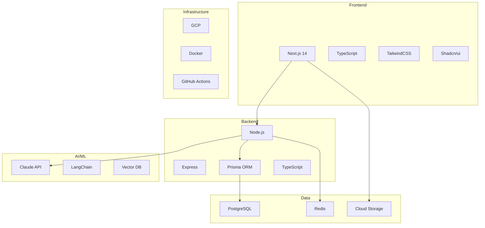
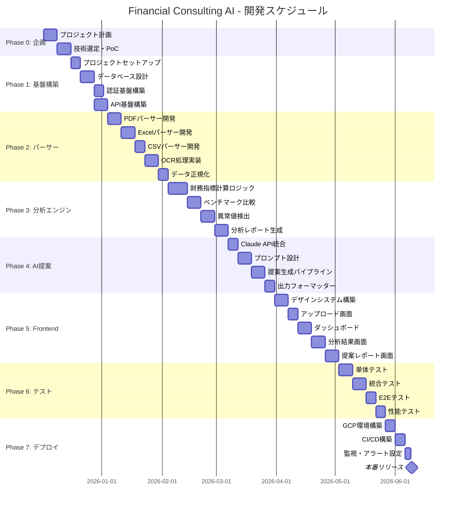
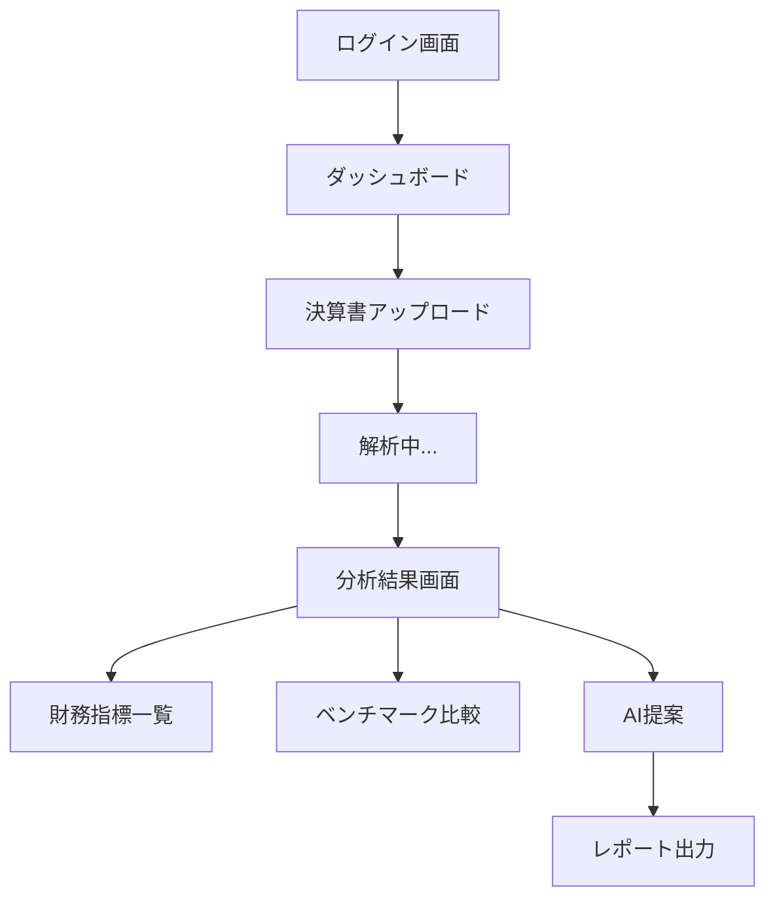
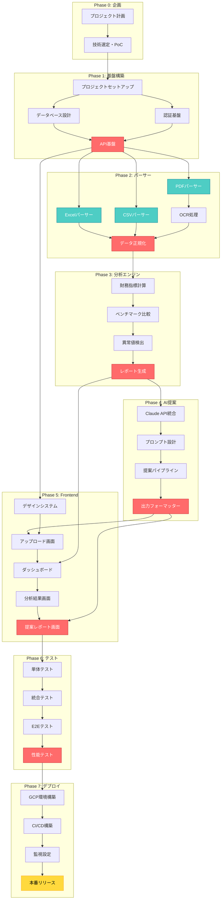
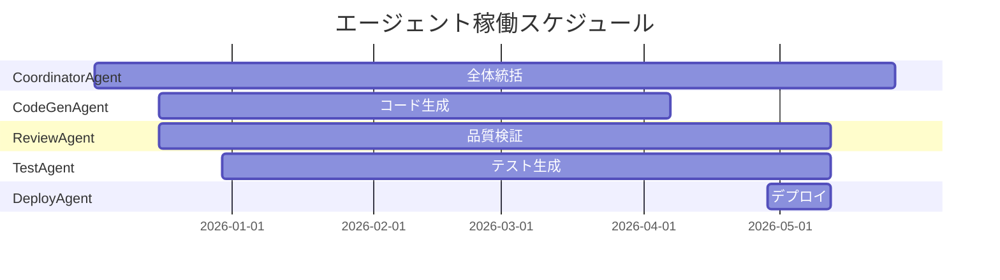
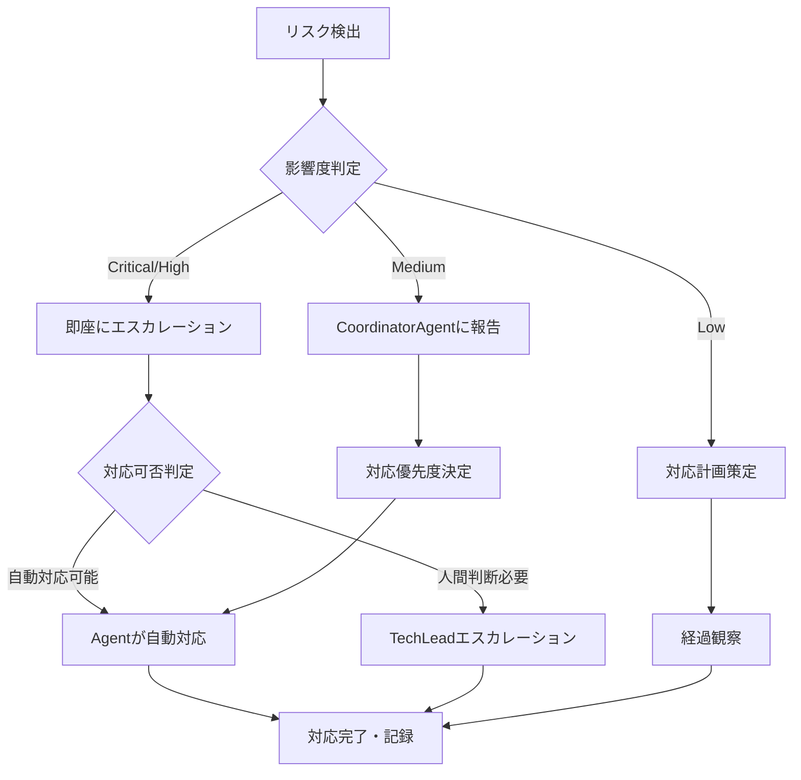
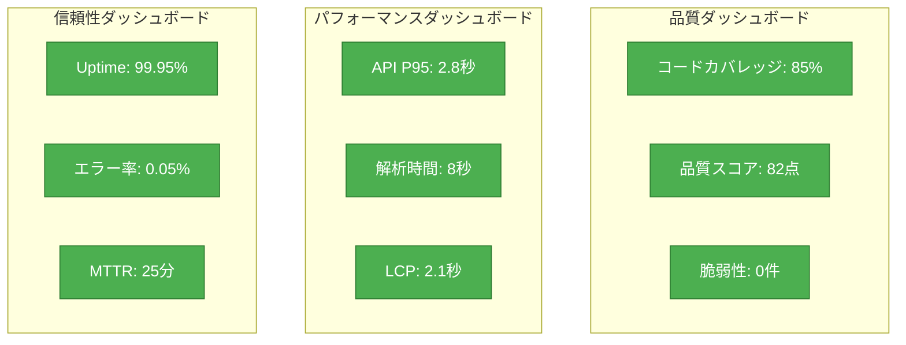

# Financial Consulting AI - 開発ロードマップ

**プロジェクト名**: Financial Consulting AI
**バージョン**: 1.0.0
**最終更新**: 2025-12-02
**ステータス**: Phase 0 - 企画中

---

## 目次

1. [プロジェクト概要](#プロジェクト概要)
2. [開発フェーズ](#開発フェーズ)
3. [ガントチャート](#ガントチャート)
4. [マイルストーン定義](#マイルストーン定義)
5. [依存関係図](#依存関係図)
6. [リソース割当](#リソース割当)
7. [リスク管理](#リスク管理)
8. [成功指標（KPI）](#成功指標kpi)
9. [スケジュール詳細](#スケジュール詳細)

---

## プロジェクト概要

### 目的

決算書（PDF/Excel/CSV）をアップロードするだけで、AIが自動的に財務分析を実施し、具体的な経営改善提案を生成するコンサルティングシステムを開発する。

### 主要機能

- **決算書パーサー**: PDF/Excel/CSV形式の決算書を自動解析
- **財務分析エンジン**: 70以上の財務指標を自動計算、業界ベンチマークと比較
- **AI提案生成**: Claude APIを活用した具体的な改善提案
- **ダッシュボード**: 視覚的に分析結果を表示
- **レポート出力**: PDF/Excel形式でのエクスポート

### 技術スタック



---

## 開発フェーズ

### 全体スケジュール概要

| フェーズ | 期間 | 工数 | 主要成果物 |
|---------|------|------|-----------|
| Phase 0 | 2週間 | 80h | プロジェクト計画書、技術選定 |
| Phase 1 | 3週間 | 120h | 基盤構築完了 |
| Phase 2 | 4週間 | 160h | パーサー完成 |
| Phase 3 | 4週間 | 160h | 分析エンジン完成 |
| Phase 4 | 3週間 | 120h | AI提案生成完成 |
| Phase 5 | 4週間 | 160h | フロントエンド完成 |
| Phase 6 | 3週間 | 120h | テスト・品質保証 |
| Phase 7 | 2週間 | 80h | デプロイ・運用開始 |
| **合計** | **25週間** | **1000h** | **MVP本番リリース** |

---

## ガントチャート



---

## マイルストーン定義

### M0: プロジェクトキックオフ（Week 0）

**目標**: プロジェクト計画承認、開発環境準備完了

**成果物**:
- プロジェクト計画書
- 技術仕様書
- リスク管理表
- 開発環境セットアップ完了

**判定基準**:
- ステークホルダー承認取得
- 開発環境でサンプルアプリが動作

---

### M1: 基盤構築完了（Week 5）

**目標**: 認証・API・データベース基盤が稼働

**成果物**:
- Turborepoモノレポ構成
- PostgreSQL + Prismaスキーマ
- NextAuth.js認証フロー
- RESTful API（OpenAPI仕様）
- 開発ドキュメント

**判定基準**:
- ログイン/ログアウトが動作
- API healthcheckが200を返す
- データベースマイグレーションが成功
- TypeScriptエラー0件
- ESLintエラー0件

**デモ内容**:
- ログイン画面でユーザー認証
- API経由でデータベースからデータ取得
- 基本的なCRUD操作

---

### M2: パーサー完成（Week 9）

**目標**: サンプル決算書（PDF/Excel/CSV）を正常に解析できる

**成果物**:
- PDFパーサー（pdf-parse, pdf.js）
- Excelパーサー（xlsx）
- CSVパーサー（csv-parse）
- OCR処理（Tesseract.js）
- データ正規化ロジック
- パーサー単体テスト（カバレッジ80%+）

**判定基準**:
- 3種類のサンプル決算書を正常解析
- 解析精度95%以上
- エラーハンドリングが適切
- パフォーマンス: 1ファイル10秒以内

**デモ内容**:
- PDF決算書をアップロード
- 自動解析後、構造化データをJSON表示
- 貸借対照表・損益計算書の数値が正確に抽出される

**テストケース**:
- 上場企業の有価証券報告書（PDF）
- 中小企業の決算書（Excel）
- 会計ソフト出力データ（CSV）

---

### M3: 分析エンジン完成（Week 13）

**目標**: 財務指標計算とベンチマーク比較が動作

**成果物**:
- 70以上の財務指標計算ロジック
- 業界別ベンチマークデータベース
- 異常値検出アルゴリズム
- 分析レポートJSON生成
- 分析エンジン単体テスト

**判定基準**:
- 全財務指標が正確に計算される（会計基準準拠）
- ベンチマーク比較が機能
- 異常値を正しく検出（統計的手法）
- 計算処理時間: 1社あたり5秒以内

**デモ内容**:
- サンプル決算書から財務指標を自動計算
- ダッシュボードに指標を表示
- 業界平均との差異をハイライト
- 異常値に警告表示

**指標例**:
- 収益性: ROE, ROA, 売上高営業利益率
- 安全性: 自己資本比率, 流動比率, 固定比率
- 効率性: 総資産回転率, 棚卸資産回転率
- 成長性: 売上高成長率, 営業利益成長率

---

### M4: AI提案生成完成（Week 16）

**目標**: Claude APIで具体的なコンサルティング提案を生成

**成果物**:
- Claude API統合コード
- プロンプトテンプレート集
- 提案生成パイプライン
- 出力フォーマッター
- AI提案サンプル集

**判定基準**:
- Claude APIから適切な提案を取得
- 提案内容が具体的かつ実行可能
- 応答時間: 30秒以内
- エラーハンドリング実装（リトライロジック）

**デモ内容**:
- 決算書をアップロード
- 自動分析後、AIが3-5個の改善提案を生成
- 提案内容: 課題、原因分析、具体的施策、期待効果
- MarkdownまたはHTML形式で出力

**提案例**:
```
【提案1】在庫回転率の改善
- 課題: 在庫回転率が業界平均の60%に留まる
- 原因: 過剰在庫による資金効率の低下
- 施策: ABC分析による在庫最適化、発注システム見直し
- 効果: 運転資金15%削減見込み
```

---

### M5: フロントエンド完成（MVP）（Week 20）

**目標**: エンドユーザーが実際に使えるWebアプリ完成

**成果物**:
- アップロード画面
- ダッシュボード
- 分析結果画面
- 提案レポート画面
- レスポンシブデザイン
- アクセシビリティ対応

**判定基準**:
- 全画面が正常に動作
- UXが直感的（ユーザビリティテスト合格）
- Lighthouse スコア: 90+（Performance, Accessibility）
- モバイル対応完了

**デモ内容**:
- エンドtoエンドフロー
  1. ログイン
  2. 決算書アップロード
  3. 自動解析・分析
  4. ダッシュボードで指標確認
  5. AI提案を閲覧
  6. PDF/Excelでレポート出力

**画面構成**:


---

### M6: テスト・品質保証完了（Week 23）

**目標**: 本番リリース可能な品質水準達成

**成果物**:
- 単体テスト（カバレッジ80%+）
- 統合テスト
- E2Eテスト（Playwright）
- パフォーマンステスト結果
- セキュリティスキャンレポート
- 品質保証レポート

**判定基準**:
- テストカバレッジ: 80%以上
- Critical/High脆弱性: 0件
- 応答時間: P95 < 3秒
- エラー率: < 0.1%
- 品質スコア: 80点以上

**テスト項目**:
- 単体テスト: 各関数・メソッドの動作確認
- 統合テスト: API連携、データベース連携
- E2Eテスト: ユーザーシナリオ全体
- パフォーマンス: 負荷テスト（100並列ユーザー）
- セキュリティ: OWASP Top 10対策確認

---

### M7: 本番リリース（Week 25）

**目標**: GCP本番環境でサービス公開

**成果物**:
- 本番環境構築完了
- CI/CDパイプライン稼働
- 監視・アラート設定
- 運用ドキュメント
- ユーザーマニュアル

**判定基準**:
- 本番環境でサービスが安定稼働
- 監視ダッシュボードが正常動作
- インシデント対応フローが整備
- ドキュメントが完備

**運用体制**:
- 監視: Cloud Monitoring, Datadog
- ログ: Cloud Logging
- アラート: Slack/Email通知
- インシデント対応: オンコール体制

**リリース基準**:
- 全テストがパス
- セキュリティスキャン合格
- ステークホルダー承認
- ロールバック手順確認済み

---

## 依存関係図

### タスク依存関係（DAG）



### クリティカルパス

**最長経路（25週間）**:

```
P0_1 → P0_2 → P1_1 → P1_2 → P1_4 →
P2_1 → P2_4 → P2_5 → P3_1 → P3_2 → P3_3 → P3_4 →
P4_1 → P4_2 → P4_3 → P4_4 →
P5_5 → P6_1 → P6_2 → P6_3 → P6_4 →
P7_1 → P7_2 → P7_3 → P7_4
```

**並列実行可能タスク**:
- Phase 1: P1_2とP1_3（認証基盤は並行開発可能）
- Phase 2: P2_1, P2_2, P2_3（各パーサーは並行開発可能）
- Phase 5: P5_1とバックエンド開発は並行可能

---

## リソース割当

### 必要エージェント構成

| エージェント | 役割 | 担当フェーズ | 稼働率 |
|------------|------|-------------|--------|
| **CoordinatorAgent** | タスク分解・進捗管理 | 全フェーズ | 100% |
| **CodeGenAgent** | TypeScriptコード生成 | Phase 1-5 | 80% |
| **ReviewAgent** | コード品質検証 | Phase 1-6 | 60% |
| **TestAgent** | テスト自動生成・実行 | Phase 2-6 | 70% |
| **IssueAgent** | Issue分析・ラベリング | 全フェーズ | 40% |
| **PRAgent** | Pull Request自動化 | Phase 1-6 | 50% |
| **DeployAgent** | CI/CD・デプロイ | Phase 7 | 100% |
| **SecurityAgent** | セキュリティスキャン | Phase 6-7 | 80% |

### フェーズ別リソース配分



### 並列実行戦略

**Phase 2: パーサー開発**
- 3つのパーサー（PDF/Excel/CSV）を並行開発
- 各パーサーに専用のCodeGenAgentを割り当て
- 統合テストはTestAgentが一元管理

**Phase 5: フロントエンド開発**
- バックエンドAPI開発と並行
- デザインシステムを先行して構築
- コンポーネント単位で並行開発

---

## リスク管理

### 技術的リスク

| リスク | 影響度 | 発生確率 | 対策 | 担当 |
|--------|--------|---------|------|------|
| **PDF解析精度不足** | High | Medium | OCR精度向上、手動補正機能追加 | CodeGenAgent |
| **Claude API障害** | Critical | Low | フォールバック機構、ローカルモデル準備 | TechLead |
| **データベース性能劣化** | High | Medium | インデックス最適化、キャッシュ戦略 | CodeGenAgent |
| **セキュリティ脆弱性** | Critical | Medium | 定期的なセキュリティスキャン、ペネトレーションテスト | SecurityAgent |
| **スケーラビリティ不足** | Medium | Medium | 水平スケーリング設計、負荷分散 | TechLead |

### スケジュールリスク

| リスク | 影響度 | 発生確率 | 対策 | 担当 |
|--------|--------|---------|------|------|
| **Phase 2遅延** | High | Medium | バッファ2週間確保、並列化推進 | CoordinatorAgent |
| **AI提案品質不足** | High | Medium | プロンプトエンジニアリング強化、早期検証 | CodeGenAgent |
| **テスト工数超過** | Medium | High | テスト自動化率向上、単体テスト早期着手 | TestAgent |
| **本番環境構築遅延** | High | Low | IaC（Terraform）で自動化 | DeployAgent |

### 品質リスク

| リスク | 影響度 | 発生確率 | 対策 | 担当 |
|--------|--------|---------|------|------|
| **コードカバレッジ未達** | Medium | Medium | 開発と同時にテスト作成 | TestAgent |
| **パフォーマンス劣化** | High | Medium | 継続的な性能測定、早期最適化 | ReviewAgent |
| **ユーザビリティ問題** | High | Medium | プロトタイプ段階でユーザーテスト | PO |

### リスク対応フロー



---

## 成功指標（KPI）

### 開発品質KPI

| 指標 | 目標値 | 測定方法 | 責任者 |
|------|--------|---------|--------|
| **コードカバレッジ** | 80%以上 | Vitest coverage | TestAgent |
| **TypeScriptエラー** | 0件 | `npm run typecheck` | ReviewAgent |
| **ESLintエラー** | 0件 | ESLint実行 | ReviewAgent |
| **品質スコア** | 80点以上 | ReviewAgent判定 | ReviewAgent |
| **セキュリティ脆弱性（Critical）** | 0件 | npm audit, Snyk | SecurityAgent |
| **セキュリティ脆弱性（High）** | 0件 | npm audit, Snyk | SecurityAgent |

### パフォーマンスKPI

| 指標 | 目標値 | 測定方法 | 責任者 |
|------|--------|---------|--------|
| **API応答時間（P95）** | 3秒以内 | k6負荷テスト | TestAgent |
| **ファイル解析時間** | 10秒以内/ファイル | パフォーマンステスト | CodeGenAgent |
| **AI提案生成時間** | 30秒以内 | パフォーマンステスト | CodeGenAgent |
| **ページ読み込み時間（FCP）** | 1.5秒以内 | Lighthouse | ReviewAgent |
| **ページ読み込み時間（LCP）** | 2.5秒以内 | Lighthouse | ReviewAgent |

### システム信頼性KPI

| 指標 | 目標値 | 測定方法 | 責任者 |
|------|--------|---------|--------|
| **稼働率（Uptime）** | 99.9%以上 | Cloud Monitoring | DeployAgent |
| **エラー率** | 0.1%以下 | エラーログ集計 | DeployAgent |
| **MTTR（平均復旧時間）** | 30分以内 | インシデント記録 | DeployAgent |
| **MTBF（平均故障間隔）** | 720時間以上 | インシデント記録 | DeployAgent |

### ビジネスKPI（MVP後）

| 指標 | 目標値 | 測定方法 | 責任者 |
|------|--------|---------|--------|
| **解析精度** | 95%以上 | 人間検証との比較 | PO |
| **ユーザー満足度** | 4.0/5.0以上 | ユーザーアンケート | PO |
| **日次アクティブユーザー** | 50人以上（初月） | Google Analytics | PO |
| **レポート出力数** | 100件/月以上 | システムログ | PO |

### KPIダッシュボード



---

## スケジュール詳細

### Phase 0: プロジェクト企画（2週間）

**Week 1: プロジェクト計画**

| タスク | 担当 | 工数 | 成果物 |
|--------|------|------|--------|
| 要件定義書作成 | PO | 16h | 要件定義書 |
| 技術仕様書作成 | TechLead | 16h | 技術仕様書 |
| アーキテクチャ設計 | TechLead | 16h | アーキテクチャ図 |
| リスク分析 | CoordinatorAgent | 8h | リスク管理表 |

**Week 2: 技術選定・PoC**

| タスク | 担当 | 工数 | 成果物 |
|--------|------|------|--------|
| PDF解析ライブラリ検証 | CodeGenAgent | 16h | PoC実装 |
| Claude API検証 | CodeGenAgent | 12h | サンプル提案 |
| インフラ構成検討 | TechLead | 12h | インフラ設計書 |
| プロジェクトキックオフ | 全員 | 4h | キックオフ議事録 |

---

### Phase 1: 基盤構築（3週間）

**Week 3: プロジェクトセットアップ**

| タスク | 担当 | 工数 | 成果物 |
|--------|------|------|--------|
| Turborepoセットアップ | CodeGenAgent | 8h | モノレポ構成 |
| TypeScript設定 | CodeGenAgent | 4h | tsconfig.json |
| ESLint/Prettier設定 | CodeGenAgent | 4h | .eslintrc.js |
| CI/CD基盤（GitHub Actions） | DeployAgent | 8h | workflow.yml |
| 開発環境ドキュメント | CodeGenAgent | 4h | README.md |

**Week 4: データベース・認証基盤**

| タスク | 担当 | 工数 | 成果物 |
|--------|------|------|--------|
| ERD設計 | TechLead | 12h | データベース設計書 |
| Prismaスキーマ定義 | CodeGenAgent | 16h | schema.prisma |
| マイグレーション | CodeGenAgent | 8h | migration files |
| NextAuth.js設定 | CodeGenAgent | 16h | 認証フロー |
| ユーザー管理API | CodeGenAgent | 8h | /api/users |

**Week 5: API基盤構築**

| タスク | 担当 | 工数 | 成果物 |
|--------|------|------|--------|
| Express APIセットアップ | CodeGenAgent | 12h | server.ts |
| OpenAPI仕様書作成 | CodeGenAgent | 16h | openapi.yaml |
| API認証ミドルウェア | CodeGenAgent | 8h | auth.middleware.ts |
| エラーハンドリング | CodeGenAgent | 8h | error.handler.ts |
| API単体テスト | TestAgent | 16h | api.test.ts |

---

### Phase 2: パーサー開発（4週間）

**Week 6: PDFパーサー**

| タスク | 担当 | 工数 | 成果物 |
|--------|------|------|--------|
| pdf-parse統合 | CodeGenAgent | 12h | pdf.parser.ts |
| PDFテーブル抽出 | CodeGenAgent | 16h | table-extractor.ts |
| PDFエラーハンドリング | CodeGenAgent | 8h | pdf.error.ts |
| PDFパーサーテスト | TestAgent | 16h | pdf.test.ts |

**Week 7: Excelパーサー**

| タスク | 担当 | 工数 | 成果物 |
|--------|------|------|--------|
| xlsx統合 | CodeGenAgent | 12h | excel.parser.ts |
| シート解析ロジック | CodeGenAgent | 16h | sheet-analyzer.ts |
| Excelエラーハンドリング | CodeGenAgent | 8h | excel.error.ts |
| Excelパーサーテスト | TestAgent | 16h | excel.test.ts |

**Week 8: CSVパーサー・OCR**

| タスク | 担当 | 工数 | 成果物 |
|--------|------|------|--------|
| csv-parse統合 | CodeGenAgent | 8h | csv.parser.ts |
| CSVパーサーテスト | TestAgent | 8h | csv.test.ts |
| Tesseract.js統合 | CodeGenAgent | 16h | ocr.service.ts |
| OCRテスト | TestAgent | 8h | ocr.test.ts |

**Week 9: データ正規化**

| タスク | 担当 | 工数 | 成果物 |
|--------|------|------|--------|
| データ正規化ロジック | CodeGenAgent | 16h | normalizer.ts |
| バリデーション | CodeGenAgent | 12h | validator.ts |
| 統合テスト | TestAgent | 16h | integration.test.ts |
| パーサードキュメント | CodeGenAgent | 8h | PARSER.md |

---

### Phase 3: 財務分析エンジン（4週間）

**Week 10-11: 財務指標計算**

| タスク | 担当 | 工数 | 成果物 |
|--------|------|------|--------|
| 財務指標定義 | TechLead | 16h | indicators.spec.ts |
| 収益性指標実装 | CodeGenAgent | 16h | profitability.ts |
| 安全性指標実装 | CodeGenAgent | 16h | safety.ts |
| 効率性指標実装 | CodeGenAgent | 16h | efficiency.ts |
| 成長性指標実装 | CodeGenAgent | 16h | growth.ts |
| 指標計算テスト | TestAgent | 24h | indicators.test.ts |

**Week 12: ベンチマーク・異常値検出**

| タスク | 担当 | 工数 | 成果物 |
|--------|------|------|--------|
| ベンチマークデータ整備 | CodeGenAgent | 16h | benchmark.db |
| 比較ロジック実装 | CodeGenAgent | 16h | comparator.ts |
| 異常値検出アルゴリズム | CodeGenAgent | 16h | anomaly-detector.ts |
| テスト | TestAgent | 16h | analysis.test.ts |

**Week 13: 分析レポート生成**

| タスク | 担当 | 工数 | 成果物 |
|--------|------|------|--------|
| レポートJSON生成 | CodeGenAgent | 16h | report-generator.ts |
| グラフデータ生成 | CodeGenAgent | 12h | chart-data.ts |
| 分析エンジンテスト | TestAgent | 16h | engine.test.ts |
| ドキュメント作成 | CodeGenAgent | 8h | ANALYSIS.md |

---

### Phase 4: AI提案生成（3週間）

**Week 14: Claude API統合**

| タスク | 担当 | 工数 | 成果物 |
|--------|------|------|--------|
| Anthropic SDK統合 | CodeGenAgent | 12h | claude.client.ts |
| API認証・設定 | CodeGenAgent | 8h | claude.config.ts |
| エラーハンドリング | CodeGenAgent | 8h | claude.error.ts |
| リトライロジック | CodeGenAgent | 8h | retry.middleware.ts |
| APIテスト | TestAgent | 16h | claude.test.ts |

**Week 15: プロンプト設計**

| タスク | 担当 | 工数 | 成果物 |
|--------|------|------|--------|
| プロンプトテンプレート設計 | TechLead | 16h | prompt-templates/ |
| 提案生成プロンプト | CodeGenAgent | 16h | consultation.prompt.ts |
| プロンプト最適化 | CodeGenAgent | 12h | prompt-optimizer.ts |
| プロンプトテスト | TestAgent | 16h | prompt.test.ts |

**Week 16: 提案パイプライン**

| タスク | 担当 | 工数 | 成果物 |
|--------|------|------|--------|
| 提案生成パイプライン | CodeGenAgent | 16h | suggestion-pipeline.ts |
| 出力フォーマッター | CodeGenAgent | 12h | formatter.ts |
| キャッシュ機構 | CodeGenAgent | 8h | cache.service.ts |
| 統合テスト | TestAgent | 16h | ai.test.ts |
| ドキュメント | CodeGenAgent | 8h | AI_SUGGESTIONS.md |

---

### Phase 5: フロントエンド開発（4週間）

**Week 17: デザインシステム**

| タスク | 担当 | 工数 | 成果物 |
|--------|------|------|--------|
| Shadcn/ui導入 | CodeGenAgent | 8h | components/ui/ |
| デザイントークン定義 | CodeGenAgent | 8h | theme.config.ts |
| 共通コンポーネント | CodeGenAgent | 16h | components/common/ |
| Storybookセットアップ | CodeGenAgent | 12h | .storybook/ |
| デザインドキュメント | CodeGenAgent | 8h | DESIGN_SYSTEM.md |

**Week 18: アップロード・ダッシュボード**

| タスク | 担当 | 工数 | 成果物 |
|--------|------|------|--------|
| ファイルアップロード画面 | CodeGenAgent | 16h | /pages/upload |
| ダッシュボード画面 | CodeGenAgent | 20h | /pages/dashboard |
| レスポンシブ対応 | CodeGenAgent | 8h | CSS調整 |
| 画面テスト | TestAgent | 16h | ui.test.ts |

**Week 19: 分析結果画面**

| タスク | 担当 | 工数 | 成果物 |
|--------|------|------|--------|
| 財務指標表示 | CodeGenAgent | 16h | /pages/analysis |
| グラフコンポーネント | CodeGenAgent | 16h | components/charts/ |
| ベンチマーク比較UI | CodeGenAgent | 12h | components/benchmark/ |
| 画面テスト | TestAgent | 16h | analysis.test.ts |

**Week 20: 提案レポート画面**

| タスク | 担当 | 工数 | 成果物 |
|--------|------|------|--------|
| AI提案表示 | CodeGenAgent | 16h | /pages/suggestions |
| PDF/Excel出力機能 | CodeGenAgent | 16h | export.service.ts |
| 印刷対応 | CodeGenAgent | 8h | print.css |
| E2Eテスト | TestAgent | 16h | e2e.test.ts |
| フロントドキュメント | CodeGenAgent | 8h | FRONTEND.md |

---

### Phase 6: テスト・品質保証（3週間）

**Week 21: 単体・統合テスト**

| タスク | 担当 | 工数 | 成果物 |
|--------|------|------|--------|
| 単体テスト追加 | TestAgent | 24h | *.test.ts |
| カバレッジ向上 | TestAgent | 16h | カバレッジレポート |
| 統合テスト | TestAgent | 24h | integration.test.ts |

**Week 22: E2E・性能テスト**

| タスク | 担当 | 工数 | 成果物 |
|--------|------|------|--------|
| Playwrightシナリオ | TestAgent | 24h | e2e/*.spec.ts |
| k6負荷テスト | TestAgent | 16h | load-test.js |
| パフォーマンス最適化 | CodeGenAgent | 16h | 最適化コード |

**Week 23: セキュリティ・品質保証**

| タスク | 担当 | 工数 | 成果物 |
|--------|------|------|--------|
| セキュリティスキャン | SecurityAgent | 16h | 脆弱性レポート |
| ペネトレーションテスト | SecurityAgent | 16h | セキュリティレポート |
| 品質保証レポート作成 | ReviewAgent | 16h | QA_REPORT.md |
| 最終レビュー | ReviewAgent | 16h | レビュー結果 |

---

### Phase 7: デプロイ・運用（2週間）

**Week 24: インフラ構築**

| タスク | 担当 | 工数 | 成果物 |
|--------|------|------|--------|
| GCP環境構築（Terraform） | DeployAgent | 16h | terraform/ |
| Cloud Run設定 | DeployAgent | 8h | cloud-run.yaml |
| Cloud SQL設定 | DeployAgent | 8h | database設定 |
| Cloud Storage設定 | DeployAgent | 8h | storage設定 |
| CI/CDパイプライン | DeployAgent | 16h | .github/workflows/ |

**Week 25: 監視・リリース**

| タスク | 担当 | 工数 | 成果物 |
|--------|------|------|--------|
| Cloud Monitoring設定 | DeployAgent | 12h | 監視ダッシュボード |
| アラート設定 | DeployAgent | 8h | アラートルール |
| 運用ドキュメント | DeployAgent | 12h | OPERATIONS.md |
| ステージング検証 | TestAgent | 12h | 検証レポート |
| 本番リリース | DeployAgent | 8h | リリース完了 |
| ポストモーテム | 全員 | 4h | 振り返り議事録 |

---

## 次のステップ

### MVP後のロードマップ（Phase 8以降）

**Phase 8: 機能拡張（4週間）**
- 複数年度比較機能
- 業界別詳細分析
- カスタムレポートテンプレート
- API外部公開

**Phase 9: エンタープライズ対応（6週間）**
- マルチテナント機能
- SSO/SAML認証
- 監査ログ
- SLA保証体制

**Phase 10: AI機能強化（4週間）**
- RAG（Retrieval-Augmented Generation）導入
- ファインチューニング
- マルチモーダル分析（画像・グラフ解析）

### 継続的改善

- 週次レトロスペクティブ
- 月次KPIレビュー
- 四半期ロードマップ見直し
- ユーザーフィードバック反映

---

## 参照ドキュメント

- [技術要件定義書](./TECHNICAL_REQUIREMENTS.md)
- [アーキテクチャ設計書](#) ※別途作成予定
- [API仕様書](#) ※OpenAPI仕様
- [運用マニュアル](#) ※Phase 7で作成

---

## 変更履歴

| 日付 | バージョン | 変更内容 | 作成者 |
|------|-----------|---------|--------|
| 2025-12-02 | 1.0.0 | 初版作成 | Claude Code |

---

**ステータス**: Phase 0 - 企画中
**次回更新**: 2025-12-16（Phase 1開始時）
**承認者**: TechLead, PO

---

このロードマップは、Miyabi Frameworkの組織設計原則に基づき、各Agentの責任範囲と権限を明確化しています。

🎯 **プロジェクト成功の3原則**:
1. **段階的リリース**: MVP → 機能拡張 → エンタープライズ
2. **品質ファースト**: 各フェーズで品質基準クリア必須
3. **自律的運用**: Agent主導でCI/CD・監視を自動化
