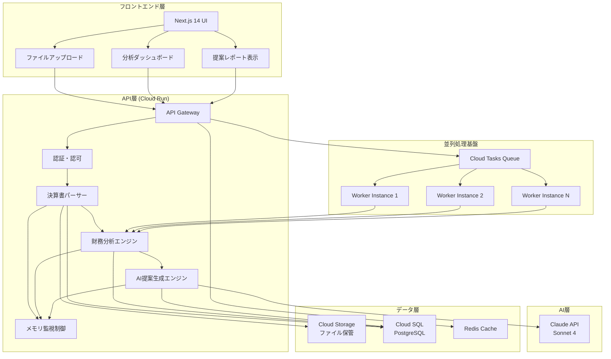
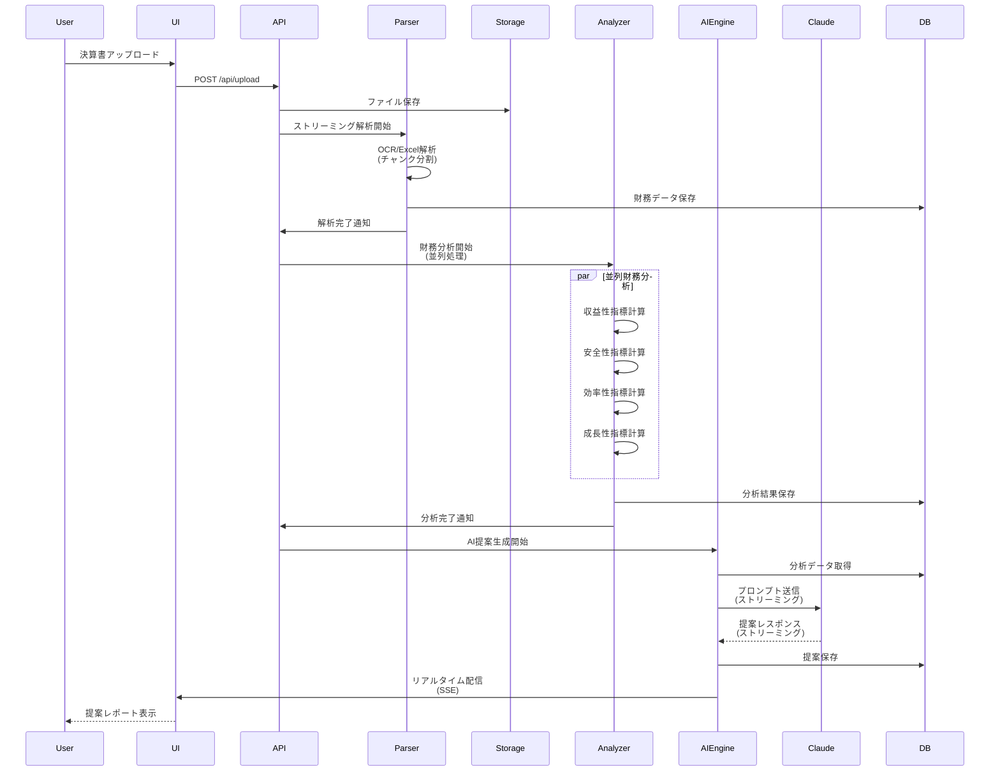
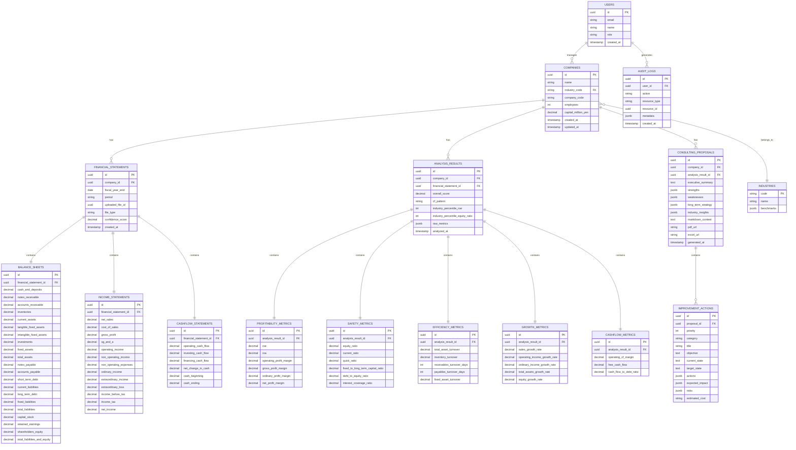

# 決算書自動コンサルティング提案システム - 技術要件書

## 1. システムアーキテクチャ

### 1.1 全体構成図



### 1.2 コンポーネント一覧

| コンポーネント | 責任 | 技術スタック |
|--------------|------|------------|
| **UI Layer** | ユーザーインターフェース | Next.js 14, React 18, Tailwind CSS, shadcn/ui |
| **API Gateway** | リクエストルーティング、認証 | Node.js, Express, TypeScript |
| **決算書パーサー** | ファイル解析、データ抽出 | Tesseract.js (OCR), xlsx, pdfjs-dist |
| **財務分析エンジン** | 財務指標計算、ベンチマーク比較 | TypeScript, Custom Algorithms |
| **AI提案生成エンジン** | AI駆動のコンサルティング提案生成 | Claude API, LangChain.js |
| **メモリ監視制御** | メモリ使用量監視・制御 | Custom Middleware, Node.js Streams |
| **データストレージ** | 永続化、キャッシュ | Cloud SQL (PostgreSQL), Redis |
| **並列処理基盤** | 大量データの並列処理 | Cloud Tasks, Worker Pool |

### 1.3 データフロー



---

## 2. 技術スタック

### 2.1 フロントエンド

| 技術 | バージョン | 用途 |
|-----|----------|------|
| **Next.js** | 14.x | SSR/SSG、App Router |
| **React** | 18.x | UI構築 |
| **TypeScript** | 5.x | 型安全性 |
| **Tailwind CSS** | 3.x | スタイリング |
| **shadcn/ui** | latest | UIコンポーネント |
| **React Query** | 5.x | サーバー状態管理 |
| **Recharts** | 2.x | 財務グラフ表示 |
| **React PDF** | 7.x | PDF表示 |

### 2.2 バックエンド

| 技術 | バージョン | 用途 |
|-----|----------|------|
| **Node.js** | 20.x LTS | ランタイム |
| **TypeScript** | 5.x | 型安全性 |
| **Express** | 4.x | APIフレームワーク |
| **Tesseract.js** | 5.x | OCR処理 |
| **pdfjs-dist** | 4.x | PDF解析 |
| **xlsx** | 0.18.x | Excel解析 |
| **csv-parser** | 3.x | CSV解析 |
| **LangChain.js** | 0.1.x | AI統合フレームワーク |

### 2.3 AI

| 技術 | モデル | 用途 |
|-----|-------|------|
| **Claude API** | claude-sonnet-4-20250514 | コンサルティング提案生成 |
| **Max Tokens** | 8,000 | レスポンス長 |
| **Streaming** | 有効 | リアルタイム配信 |

### 2.4 データベース

| 技術 | バージョン | 用途 |
|-----|----------|------|
| **PostgreSQL** | 15.x | メインDB |
| **Redis** | 7.x | キャッシュ、セッション |
| **Prisma** | 5.x | ORM |

### 2.5 インフラ (Google Cloud)

| サービス | 用途 |
|---------|------|
| **Cloud Run** | APIサーバー、Workerホスティング |
| **Cloud SQL** | PostgreSQLマネージドサービス |
| **Cloud Storage** | ファイル保管 |
| **Cloud Tasks** | 非同期ジョブキュー |
| **Cloud Build** | CI/CD |
| **Cloud Monitoring** | メトリクス監視 |
| **Secret Manager** | 認証情報管理 |

---

## 3. 決算書パーサー仕様

### 3.1 対応フォーマット

| フォーマット | 拡張子 | 処理方式 | 最大ファイルサイズ |
|------------|-------|---------|------------------|
| **PDF** | .pdf | OCR (Tesseract.js) + テキスト抽出 | 50MB |
| **Excel** | .xlsx, .xls | xlsx ライブラリ | 20MB |
| **CSV** | .csv | csv-parser | 10MB |

### 3.2 OCR処理 (PDF専用)

```typescript
interface OCRConfig {
  lang: 'jpn+eng'; // 日本語・英語対応
  tessedit_pageseg_mode: '1'; // 自動ページセグメンテーション
  preserve_interword_spaces: '1'; // 単語間スペース保持
}

// チャンク分割処理
interface ChunkConfig {
  maxChunkSize: 5 * 1024 * 1024; // 5MB/chunk
  overlapPages: 2; // ページオーバーラップ
  parallelWorkers: 4; // 並列Worker数
}
```

### 3.3 データ正規化ルール

#### 3.3.1 勘定科目マッピング

```typescript
// 標準勘定科目への正規化マッピング
const accountMapping: Record<string, string> = {
  // 資産の部
  '現金及び預金': 'cash_and_deposits',
  '現金・預金': 'cash_and_deposits',
  '受取手形': 'notes_receivable',
  '売掛金': 'accounts_receivable',
  '棚卸資産': 'inventories',
  '商品': 'merchandise',
  '製品': 'finished_goods',
  '有形固定資産': 'tangible_fixed_assets',
  '建物': 'buildings',
  '機械装置': 'machinery',

  // 負債の部
  '支払手形': 'notes_payable',
  '買掛金': 'accounts_payable',
  '短期借入金': 'short_term_debt',
  '長期借入金': 'long_term_debt',

  // 純資産の部
  '資本金': 'capital_stock',
  '利益剰余金': 'retained_earnings',

  // 損益計算書
  '売上高': 'net_sales',
  '売上原価': 'cost_of_sales',
  '販売費及び一般管理費': 'sg_and_a',
  '営業利益': 'operating_income',
  '経常利益': 'ordinary_income',
  '当期純利益': 'net_income',
};
```

#### 3.3.2 数値正規化

```typescript
interface NormalizationRule {
  // カンマ除去: "1,000,000" → 1000000
  removeCommas: true;

  // 括弧の負数処理: "(1000)" → -1000
  handleParentheses: true;

  // 単位変換: "百万円" → 1,000,000倍
  unitConversion: {
    '千円': 1_000,
    '百万円': 1_000_000,
    '億円': 100_000_000,
  };

  // 小数点処理
  decimalPlaces: 0; // 円単位まで
}
```

#### 3.3.3 会計期間正規化

```typescript
interface FiscalPeriod {
  startDate: Date; // 会計期間開始日
  endDate: Date;   // 会計期間終了日
  fiscalYear: number; // 会計年度（例: 2024）
  period: 'Q1' | 'Q2' | 'Q3' | 'Q4' | 'FY'; // 期間区分
}

// 日本の会計年度パターン検出
// 例: "令和6年3月期" → FY2024-03-31
// 例: "2024年3月期" → FY2024-03-31
```

### 3.4 パーサーAPI仕様

```typescript
interface ParseRequest {
  fileId: string;
  fileType: 'pdf' | 'excel' | 'csv';
  options?: {
    ocrEnabled?: boolean;
    autoDetectFiscalYear?: boolean;
    strictValidation?: boolean;
  };
}

interface ParseResponse {
  success: boolean;
  data: {
    balanceSheet?: BalanceSheetData;
    incomeStatement?: IncomeStatementData;
    cashFlowStatement?: CashFlowStatementData;
    fiscalPeriod: FiscalPeriod;
    confidence: number; // 解析信頼度 (0-1)
  };
  errors?: ParseError[];
  warnings?: ParseWarning[];
}
```

---

## 4. 財務分析エンジン仕様

### 4.1 収益性指標

```typescript
interface ProfitabilityMetrics {
  // ROE (自己資本利益率) = 当期純利益 / 自己資本 × 100
  roe: {
    value: number;
    formula: 'net_income / shareholders_equity * 100';
    benchmark: {
      excellent: '>= 15%',
      good: '>= 10%',
      average: '>= 5%',
      poor: '< 5%',
    };
  };

  // ROA (総資産利益率) = 当期純利益 / 総資産 × 100
  roa: {
    value: number;
    formula: 'net_income / total_assets * 100';
    benchmark: {
      excellent: '>= 5%',
      good: '>= 3%',
      average: '>= 1%',
      poor: '< 1%',
    };
  };

  // 売上高営業利益率 = 営業利益 / 売上高 × 100
  operatingProfitMargin: {
    value: number;
    formula: 'operating_income / net_sales * 100';
    benchmark: {
      excellent: '>= 10%',
      good: '>= 5%',
      average: '>= 3%',
      poor: '< 3%',
    };
  };

  // 売上総利益率 = (売上高 - 売上原価) / 売上高 × 100
  grossProfitMargin: {
    value: number;
    formula: '(net_sales - cost_of_sales) / net_sales * 100';
  };

  // 経常利益率 = 経常利益 / 売上高 × 100
  ordinaryProfitMargin: {
    value: number;
    formula: 'ordinary_income / net_sales * 100';
  };

  // 当期純利益率 = 当期純利益 / 売上高 × 100
  netProfitMargin: {
    value: number;
    formula: 'net_income / net_sales * 100';
  };
}
```

### 4.2 安全性指標

```typescript
interface SafetyMetrics {
  // 自己資本比率 = 自己資本 / 総資産 × 100
  equityRatio: {
    value: number;
    formula: 'shareholders_equity / total_assets * 100';
    benchmark: {
      excellent: '>= 50%',
      good: '>= 30%',
      average: '>= 20%',
      poor: '< 20%',
    };
  };

  // 流動比率 = 流動資産 / 流動負債 × 100
  currentRatio: {
    value: number;
    formula: 'current_assets / current_liabilities * 100';
    benchmark: {
      excellent: '>= 200%',
      good: '>= 150%',
      average: '>= 100%',
      poor: '< 100%',
    };
  };

  // 当座比率 = (流動資産 - 棚卸資産) / 流動負債 × 100
  quickRatio: {
    value: number;
    formula: '(current_assets - inventories) / current_liabilities * 100';
    benchmark: {
      excellent: '>= 100%',
      good: '>= 80%',
      average: '>= 60%',
      poor: '< 60%',
    };
  };

  // 固定長期適合率 = 固定資産 / (自己資本 + 固定負債) × 100
  fixedToLongTermCapitalRatio: {
    value: number;
    formula: 'fixed_assets / (shareholders_equity + long_term_liabilities) * 100';
    benchmark: {
      excellent: '<= 80%',
      good: '<= 100%',
      average: '<= 120%',
      poor: '> 120%',
    };
  };

  // 負債比率 = 負債合計 / 自己資本 × 100
  debtToEquityRatio: {
    value: number;
    formula: 'total_liabilities / shareholders_equity * 100';
  };

  // インタレスト・カバレッジ・レシオ = 営業利益 / 支払利息
  interestCoverageRatio: {
    value: number;
    formula: 'operating_income / interest_expense';
    benchmark: {
      excellent: '>= 10',
      good: '>= 5',
      average: '>= 2',
      poor: '< 2',
    };
  };
}
```

### 4.3 効率性指標

```typescript
interface EfficiencyMetrics {
  // 総資産回転率 = 売上高 / 総資産
  totalAssetTurnover: {
    value: number;
    formula: 'net_sales / total_assets';
    benchmark: {
      excellent: '>= 1.5',
      good: '>= 1.0',
      average: '>= 0.8',
      poor: '< 0.8',
    };
  };

  // 棚卸資産回転率 = 売上原価 / 棚卸資産
  inventoryTurnover: {
    value: number;
    formula: 'cost_of_sales / inventories';
    unit: '回';
  };

  // 売上債権回転期間 = (受取手形 + 売掛金) / (売上高 / 365)
  receivablesTurnoverDays: {
    value: number;
    formula: '(notes_receivable + accounts_receivable) / (net_sales / 365)';
    unit: '日';
  };

  // 買入債務回転期間 = (支払手形 + 買掛金) / (売上原価 / 365)
  payablesTurnoverDays: {
    value: number;
    formula: '(notes_payable + accounts_payable) / (cost_of_sales / 365)';
    unit: '日';
  };

  // 固定資産回転率 = 売上高 / 固定資産
  fixedAssetTurnover: {
    value: number;
    formula: 'net_sales / fixed_assets';
  };
}
```

### 4.4 成長性指標

```typescript
interface GrowthMetrics {
  // 売上高成長率 = (当期売上高 - 前期売上高) / 前期売上高 × 100
  salesGrowthRate: {
    value: number;
    formula: '(current_sales - previous_sales) / previous_sales * 100';
    yoy: number; // 前年同期比
  };

  // 営業利益成長率
  operatingIncomeGrowthRate: {
    value: number;
    yoy: number;
  };

  // 経常利益成長率
  ordinaryIncomeGrowthRate: {
    value: number;
    yoy: number;
  };

  // 総資産成長率
  totalAssetsGrowthRate: {
    value: number;
    yoy: number;
  };

  // 自己資本成長率
  equityGrowthRate: {
    value: number;
    yoy: number;
  };

  // 従業員数成長率
  employeeGrowthRate: {
    value: number;
    yoy: number;
  };
}
```

### 4.5 キャッシュフロー分析

```typescript
interface CashFlowMetrics {
  // 営業CFマージン = 営業CF / 売上高 × 100
  operatingCfMargin: {
    value: number;
    formula: 'operating_cash_flow / net_sales * 100';
  };

  // フリーCF = 営業CF - 投資CF
  freeCashFlow: {
    value: number;
    formula: 'operating_cash_flow - investing_cash_flow';
  };

  // CF対負債比率 = 営業CF / 有利子負債
  cashFlowToDebtRatio: {
    value: number;
    formula: 'operating_cash_flow / interest_bearing_debt';
  };

  // CFパターン分析
  cashFlowPattern: {
    type: 'healthy' | 'growth' | 'restructuring' | 'distressed';
    description: string;
    // 健全型: 営業CF+ / 投資CF- / 財務CF-
    // 成長型: 営業CF+ / 投資CF- / 財務CF+
    // リストラ型: 営業CF- / 投資CF+ / 財務CF-
    // 危機型: 営業CF- / 投資CF- / 財務CF+
  };
}
```

### 4.6 業界ベンチマーク比較ロジック

```typescript
interface IndustryBenchmark {
  industryCode: string; // 日本標準産業分類コード
  industryName: string;

  benchmarks: {
    profitability: {
      roe: { median: number; upperQuartile: number; lowerQuartile: number };
      roa: { median: number; upperQuartile: number; lowerQuartile: number };
      operatingMargin: { median: number; upperQuartile: number; lowerQuartile: number };
    };
    safety: {
      equityRatio: { median: number; upperQuartile: number; lowerQuartile: number };
      currentRatio: { median: number; upperQuartile: number; lowerQuartile: number };
    };
    efficiency: {
      totalAssetTurnover: { median: number; upperQuartile: number; lowerQuartile: number };
      inventoryTurnover: { median: number; upperQuartile: number; lowerQuartile: number };
    };
  };

  // 業界内順位（パーセンタイル）
  percentileRank: {
    roe: number; // 0-100
    roa: number;
    equityRatio: number;
    // ...
  };
}

// データソース: 日本政策金融公庫「小企業の経営指標調査」
// TKC経営指標、中小企業実態基本調査など
```

### 4.7 並列処理実装

```typescript
// 指標計算の並列実行
async function calculateAllMetrics(
  financialData: FinancialData
): Promise<ComprehensiveAnalysis> {
  const [
    profitability,
    safety,
    efficiency,
    growth,
    cashFlow,
    benchmark
  ] = await Promise.all([
    calculateProfitabilityMetrics(financialData),
    calculateSafetyMetrics(financialData),
    calculateEfficiencyMetrics(financialData),
    calculateGrowthMetrics(financialData),
    calculateCashFlowMetrics(financialData),
    fetchIndustryBenchmark(financialData.industryCode),
  ]);

  return {
    profitability,
    safety,
    efficiency,
    growth,
    cashFlow,
    benchmark,
    overallScore: calculateOverallScore({
      profitability,
      safety,
      efficiency,
      growth,
    }),
  };
}
```

---

## 5. AI提案生成エンジン仕様

### 5.1 Claude APIプロンプト設計

```typescript
interface PromptTemplate {
  system: string;
  user: string;
  temperature: number;
  max_tokens: number;
}

const consultingPrompt: PromptTemplate = {
  system: `
あなたは20年以上の経験を持つプロの経営コンサルタントです。
中小企業の財務分析結果に基づき、具体的で実行可能な経営改善提案を行います。

【提案の原則】
1. データドリブン: 財務指標を根拠とした客観的提案
2. 具体性: すぐ実行できるアクションプラン
3. 優先順位: 影響度・実現可能性でランク付け
4. 業界知見: ベンチマークと比較した相対評価
5. リスク考慮: 実行時の注意点・リスクも明示

【出力形式】
- 経営概況サマリー (200字以内)
- 強み (3-5項目)
- 課題 (3-5項目)
- 優先改善施策 (Top 3、各500字程度)
- 長期戦略提言 (300字程度)
`,

  user: `
以下の企業の財務分析結果に基づき、経営改善提案を作成してください。

## 企業基本情報
- 業種: {{industry}}
- 会計年度: {{fiscalYear}}
- 従業員数: {{employees}}人
- 資本金: {{capital}}百万円

## 財務分析結果

### 収益性指標
- ROE: {{roe}}% (業界中央値: {{roe_benchmark}}%)
- ROA: {{roa}}% (業界中央値: {{roa_benchmark}}%)
- 営業利益率: {{operatingMargin}}% (業界中央値: {{operatingMargin_benchmark}}%)
- 売上総利益率: {{grossMargin}}%

### 安全性指標
- 自己資本比率: {{equityRatio}}% (業界中央値: {{equityRatio_benchmark}}%)
- 流動比率: {{currentRatio}}%
- 負債比率: {{debtToEquityRatio}}%

### 効率性指標
- 総資産回転率: {{totalAssetTurnover}}回
- 棚卸資産回転率: {{inventoryTurnover}}回
- 売上債権回転期間: {{receivablesDays}}日

### 成長性指標
- 売上高成長率 (YoY): {{salesGrowth}}%
- 営業利益成長率 (YoY): {{operatingIncomeGrowth}}%

### キャッシュフロー
- 営業CF: {{operatingCF}}百万円
- 投資CF: {{investingCF}}百万円
- 財務CF: {{financingCF}}百万円
- フリーCF: {{freeCF}}百万円
- CFパターン: {{cfPattern}}

### 業界内順位
- ROE: 上位{{roePercentile}}%
- 自己資本比率: 上位{{equityRatioPercentile}}%

## 前年度比較
{{yearOverYearComparison}}

---

上記データを踏まえ、経営改善提案書を作成してください。
`,

  temperature: 0.7,
  max_tokens: 8000,
};
```

### 5.2 提案テンプレート構造

```typescript
interface ConsultingProposal {
  // エグゼクティブサマリー
  executiveSummary: {
    overallAssessment: string; // 総合評価 (200字)
    keyFindings: string[]; // 主要発見事項 (3-5項目)
    urgentActions: string[]; // 緊急対応事項
  };

  // 強み分析
  strengths: Array<{
    title: string;
    description: string;
    evidence: string; // 裏付けとなる財務指標
    recommendation: string; // さらに伸ばす方法
  }>;

  // 課題分析
  weaknesses: Array<{
    title: string;
    description: string;
    evidence: string;
    severity: 'critical' | 'high' | 'medium' | 'low';
    impact: string; // 業績への影響
  }>;

  // 改善施策 (優先順位順)
  improvements: Array<{
    priority: number; // 1-3 (Top 3)
    title: string;
    category: '収益性改善' | '財務健全化' | '業務効率化' | '成長戦略';
    objective: string; // 目的
    currentState: string; // 現状
    targetState: string; // 目指す姿
    actions: Array<{
      step: number;
      description: string;
      timeframe: string; // 実施期間
      responsible: string; // 担当部門
      kpi: string; // 成功指標
    }>;
    expectedImpact: {
      financial: string; // 財務的効果
      quantitative: string; // 定量効果 (例: 営業利益率+2%pt)
    };
    risks: string[]; // リスクと対応策
    estimatedCost: string; // 概算コスト
  }>;

  // 長期戦略提言
  longTermStrategy: {
    vision: string; // 3-5年後のビジョン
    strategicDirections: string[]; // 戦略的方向性
    investmentPriorities: string[]; // 投資優先領域
  };

  // 業界動向・競合分析
  industryInsights: {
    trends: string[]; // 業界トレンド
    opportunities: string[]; // 機会
    threats: string[]; // 脅威
  };

  // 次回分析に向けた提言
  nextSteps: {
    dataToCollect: string[]; // 追加収集すべきデータ
    monitoringKPIs: string[]; // モニタリングすべきKPI
    reviewSchedule: string; // レビュースケジュール
  };
}
```

### 5.3 出力フォーマット

#### 5.3.1 Markdown出力

```typescript
interface MarkdownExportOptions {
  includeTOC: boolean; // 目次生成
  includeCharts: boolean; // グラフ画像埋め込み
  includeRawData: boolean; // 元データ表掲載
  template: 'standard' | 'executive' | 'detailed';
}

// 出力例: proposal_20240331.md
```

#### 5.3.2 PDF出力

```typescript
interface PDFExportOptions {
  layout: 'A4' | 'Letter';
  orientation: 'portrait' | 'landscape';
  includeCompanyLogo: boolean;
  includeWatermark: boolean;
  theme: 'professional' | 'modern' | 'classic';
  charts: {
    colorScheme: 'blue' | 'green' | 'corporate';
    showDataLabels: boolean;
  };
}

// 生成ライブラリ: puppeteer (HTML→PDF変換)
// テンプレートエンジン: Handlebars
```

#### 5.3.3 Excel出力

```typescript
interface ExcelExportOptions {
  sheets: {
    summary: boolean; // サマリーシート
    detailedMetrics: boolean; // 詳細指標
    trends: boolean; // トレンド分析
    comparison: boolean; // 業界比較
    actionPlan: boolean; // アクションプラン
  };
  includeCharts: boolean;
  includeFormatting: boolean;
}

// 生成ライブラリ: exceljs
```

### 5.4 ストリーミング実装

```typescript
// Server-Sent Events (SSE) でリアルタイム配信
async function streamProposal(
  analysisId: string,
  res: Response
): Promise<void> {
  res.setHeader('Content-Type', 'text/event-stream');
  res.setHeader('Cache-Control', 'no-cache');
  res.setHeader('Connection', 'keep-alive');

  const stream = await anthropic.messages.stream({
    model: 'claude-sonnet-4-20250514',
    max_tokens: 8000,
    temperature: 0.7,
    messages: [{ role: 'user', content: buildPrompt(analysisId) }],
  });

  for await (const chunk of stream) {
    if (chunk.type === 'content_block_delta') {
      res.write(`data: ${JSON.stringify({
        type: 'content',
        text: chunk.delta.text
      })}\n\n`);
    }
  }

  res.write(`data: ${JSON.stringify({ type: 'done' })}\n\n`);
  res.end();
}
```

---

## 6. データベース設計

### 6.1 ER図



### 6.2 主要テーブル定義

#### 6.2.1 companies (企業マスタ)

```sql
CREATE TABLE companies (
  id UUID PRIMARY KEY DEFAULT gen_random_uuid(),
  name VARCHAR(255) NOT NULL,
  industry_code VARCHAR(10) REFERENCES industries(code),
  company_code VARCHAR(50), -- 法人番号
  employees INTEGER,
  capital_million_yen DECIMAL(15, 2),
  created_at TIMESTAMP DEFAULT CURRENT_TIMESTAMP,
  updated_at TIMESTAMP DEFAULT CURRENT_TIMESTAMP,

  INDEX idx_industry_code (industry_code),
  INDEX idx_company_code (company_code)
);
```

#### 6.2.2 financial_statements (決算書メタデータ)

```sql
CREATE TABLE financial_statements (
  id UUID PRIMARY KEY DEFAULT gen_random_uuid(),
  company_id UUID NOT NULL REFERENCES companies(id) ON DELETE CASCADE,
  fiscal_year_end DATE NOT NULL,
  period VARCHAR(10) NOT NULL, -- 'Q1', 'Q2', 'Q3', 'Q4', 'FY'
  uploaded_file_id UUID,
  file_type VARCHAR(20) NOT NULL, -- 'pdf', 'excel', 'csv'
  confidence_score DECIMAL(3, 2), -- 解析信頼度 (0.00-1.00)
  created_at TIMESTAMP DEFAULT CURRENT_TIMESTAMP,

  INDEX idx_company_fiscal (company_id, fiscal_year_end),
  INDEX idx_uploaded_file (uploaded_file_id)
);
```

#### 6.2.3 analysis_results (分析結果サマリー)

```sql
CREATE TABLE analysis_results (
  id UUID PRIMARY KEY DEFAULT gen_random_uuid(),
  company_id UUID NOT NULL REFERENCES companies(id) ON DELETE CASCADE,
  financial_statement_id UUID NOT NULL REFERENCES financial_statements(id) ON DELETE CASCADE,
  overall_score DECIMAL(5, 2), -- 総合スコア (0-100)
  cf_pattern VARCHAR(50), -- 'healthy', 'growth', 'restructuring', 'distressed'
  industry_percentile_roe INTEGER, -- 業界内順位 (0-100)
  industry_percentile_equity_ratio INTEGER,
  raw_metrics JSONB, -- 全指標JSON格納
  analyzed_at TIMESTAMP DEFAULT CURRENT_TIMESTAMP,

  INDEX idx_company_analyzed (company_id, analyzed_at),
  INDEX idx_financial_statement (financial_statement_id)
);
```

#### 6.2.4 consulting_proposals (提案書)

```sql
CREATE TABLE consulting_proposals (
  id UUID PRIMARY KEY DEFAULT gen_random_uuid(),
  company_id UUID NOT NULL REFERENCES companies(id) ON DELETE CASCADE,
  analysis_result_id UUID NOT NULL REFERENCES analysis_results(id) ON DELETE CASCADE,
  executive_summary TEXT,
  strengths JSONB,
  weaknesses JSONB,
  long_term_strategy JSONB,
  industry_insights JSONB,
  markdown_content TEXT,
  pdf_url VARCHAR(512), -- Cloud Storage URL
  excel_url VARCHAR(512),
  generated_at TIMESTAMP DEFAULT CURRENT_TIMESTAMP,

  INDEX idx_company_generated (company_id, generated_at),
  INDEX idx_analysis_result (analysis_result_id)
);
```

### 6.3 インデックス戦略

```sql
-- 複合インデックス
CREATE INDEX idx_fs_company_fiscal_period
  ON financial_statements(company_id, fiscal_year_end DESC, period);

CREATE INDEX idx_analysis_company_date
  ON analysis_results(company_id, analyzed_at DESC);

-- 部分インデックス
CREATE INDEX idx_high_confidence_statements
  ON financial_statements(company_id, fiscal_year_end)
  WHERE confidence_score >= 0.8;

-- GIN インデックス (JSONB検索用)
CREATE INDEX idx_analysis_raw_metrics_gin
  ON analysis_results USING GIN(raw_metrics);

-- 全文検索インデックス
CREATE INDEX idx_proposals_markdown_fts
  ON consulting_proposals USING GIN(to_tsvector('japanese', markdown_content));
```

---

## 7. API設計

### 7.1 主要エンドポイント一覧

| Method | Endpoint | 説明 | 認証 |
|--------|----------|------|------|
| POST | `/api/v1/upload` | 決算書ファイルアップロード | 必須 |
| GET | `/api/v1/parse/{fileId}` | 解析ステータス取得 | 必須 |
| POST | `/api/v1/analyze` | 財務分析実行 | 必須 |
| GET | `/api/v1/analysis/{analysisId}` | 分析結果取得 | 必須 |
| POST | `/api/v1/proposals/generate` | AI提案生成 | 必須 |
| GET | `/api/v1/proposals/{proposalId}` | 提案書取得 | 必須 |
| GET | `/api/v1/proposals/{proposalId}/stream` | 提案書ストリーミング配信 | 必須 |
| GET | `/api/v1/proposals/{proposalId}/export` | 提案書エクスポート (PDF/Excel) | 必須 |
| GET | `/api/v1/companies/{companyId}/history` | 分析履歴取得 | 必須 |
| GET | `/api/v1/industries/{code}/benchmarks` | 業界ベンチマーク取得 | 必須 |

### 7.2 OpenAPI仕様概要

```yaml
openapi: 3.0.3
info:
  title: 決算書自動コンサルティング提案システム API
  version: 1.0.0
  description: |
    AI駆動の決算書分析・コンサルティング提案生成API

    ## 認証方式
    - Bearer Token (JWT)
    - API Key (X-API-Key ヘッダー)

servers:
  - url: https://api.consulting.example.com/v1
    description: Production
  - url: https://staging.api.consulting.example.com/v1
    description: Staging

tags:
  - name: Upload
    description: ファイルアップロード
  - name: Parse
    description: 決算書解析
  - name: Analyze
    description: 財務分析
  - name: Proposals
    description: AI提案生成
  - name: Companies
    description: 企業管理
  - name: Industries
    description: 業界情報

paths:
  /upload:
    post:
      tags: [Upload]
      summary: 決算書ファイルアップロード
      operationId: uploadFinancialStatement
      requestBody:
        required: true
        content:
          multipart/form-data:
            schema:
              type: object
              required:
                - file
                - companyId
                - fiscalYearEnd
              properties:
                file:
                  type: string
                  format: binary
                  description: PDF/Excel/CSVファイル (最大50MB)
                companyId:
                  type: string
                  format: uuid
                fiscalYearEnd:
                  type: string
                  format: date
                  example: "2024-03-31"
                period:
                  type: string
                  enum: [Q1, Q2, Q3, Q4, FY]
                  default: FY
                options:
                  type: object
                  properties:
                    autoAnalyze:
                      type: boolean
                      default: false
                      description: アップロード後に自動で財務分析を実行
                    ocrEnabled:
                      type: boolean
                      default: true
      responses:
        '201':
          description: アップロード成功
          content:
            application/json:
              schema:
                type: object
                properties:
                  fileId:
                    type: string
                    format: uuid
                  status:
                    type: string
                    enum: [uploaded, parsing, completed, failed]
                  uploadedAt:
                    type: string
                    format: date-time
        '400':
          $ref: '#/components/responses/BadRequest'
        '413':
          description: ファイルサイズ超過

  /analyze:
    post:
      tags: [Analyze]
      summary: 財務分析実行
      operationId: analyzeFinancialStatement
      requestBody:
        required: true
        content:
          application/json:
            schema:
              type: object
              required:
                - financialStatementId
              properties:
                financialStatementId:
                  type: string
                  format: uuid
                options:
                  type: object
                  properties:
                    includeBenchmark:
                      type: boolean
                      default: true
                    autoGenerateProposal:
                      type: boolean
                      default: false
                      description: 分析後に自動でAI提案生成
      responses:
        '202':
          description: 分析ジョブ受付
          content:
            application/json:
              schema:
                type: object
                properties:
                  analysisId:
                    type: string
                    format: uuid
                  status:
                    type: string
                    enum: [queued, processing, completed, failed]
                  estimatedDuration:
                    type: integer
                    description: 推定処理時間 (秒)
                    example: 30

  /proposals/generate:
    post:
      tags: [Proposals]
      summary: AI提案生成
      operationId: generateConsultingProposal
      requestBody:
        required: true
        content:
          application/json:
            schema:
              type: object
              required:
                - analysisId
              properties:
                analysisId:
                  type: string
                  format: uuid
                options:
                  type: object
                  properties:
                    template:
                      type: string
                      enum: [standard, executive, detailed]
                      default: standard
                    includeCharts:
                      type: boolean
                      default: true
      responses:
        '202':
          description: 生成ジョブ受付
          content:
            application/json:
              schema:
                type: object
                properties:
                  proposalId:
                    type: string
                    format: uuid
                  status:
                    type: string
                    enum: [queued, generating, completed, failed]
                  streamUrl:
                    type: string
                    format: uri
                    description: SSEストリーミングURL
                    example: "/api/v1/proposals/{proposalId}/stream"

  /proposals/{proposalId}/stream:
    get:
      tags: [Proposals]
      summary: 提案書リアルタイム配信 (SSE)
      operationId: streamProposal
      parameters:
        - name: proposalId
          in: path
          required: true
          schema:
            type: string
            format: uuid
      responses:
        '200':
          description: Server-Sent Events ストリーム
          content:
            text/event-stream:
              schema:
                type: string
                example: |
                  data: {"type":"content","text":"## 経営概況サマリー\n\n"}

                  data: {"type":"content","text":"貴社の財務状況は..."}

                  data: {"type":"done"}

  /proposals/{proposalId}/export:
    get:
      tags: [Proposals]
      summary: 提案書エクスポート
      operationId: exportProposal
      parameters:
        - name: proposalId
          in: path
          required: true
          schema:
            type: string
            format: uuid
        - name: format
          in: query
          required: true
          schema:
            type: string
            enum: [pdf, excel, markdown]
        - name: template
          in: query
          schema:
            type: string
            enum: [professional, modern, classic]
            default: professional
      responses:
        '200':
          description: ファイルダウンロード
          content:
            application/pdf:
              schema:
                type: string
                format: binary
            application/vnd.openxmlformats-officedocument.spreadsheetml.sheet:
              schema:
                type: string
                format: binary
            text/markdown:
              schema:
                type: string

components:
  securitySchemes:
    bearerAuth:
      type: http
      scheme: bearer
      bearerFormat: JWT
    apiKeyAuth:
      type: apiKey
      in: header
      name: X-API-Key

  responses:
    BadRequest:
      description: リクエストエラー
      content:
        application/json:
          schema:
            type: object
            properties:
              error:
                type: string
              details:
                type: array
                items:
                  type: object
                  properties:
                    field:
                      type: string
                    message:
                      type: string

security:
  - bearerAuth: []
  - apiKeyAuth: []
```

---

## 8. メモリ効率化設計

### 8.1 ストリーミング処理

```typescript
import { Readable, Transform } from 'stream';
import { pipeline } from 'stream/promises';

// PDFページ単位ストリーミング解析
async function streamPdfParsing(
  filePath: string
): Promise<void> {
  const pageStream = createPdfPageStream(filePath);
  const ocrStream = createOcrTransform();
  const normalizationStream = createNormalizationTransform();
  const dbWriteStream = createDatabaseWriteStream();

  await pipeline(
    pageStream,
    ocrStream,
    normalizationStream,
    dbWriteStream
  );
}

// メモリ使用量監視付きTransformStream
class MemoryAwareTransform extends Transform {
  private memoryThreshold = 0.92; // 92%

  async _transform(chunk: any, encoding: string, callback: Function) {
    const memUsage = process.memoryUsage().heapUsed / process.memoryUsage().heapTotal;

    if (memUsage > this.memoryThreshold) {
      // バックプレッシャー適用
      await this.waitForMemoryRelease();
    }

    // 処理実行
    const result = await this.processChunk(chunk);
    callback(null, result);
  }

  private async waitForMemoryRelease(): Promise<void> {
    global.gc?.(); // ガベージコレクション強制実行
    await new Promise(resolve => setTimeout(resolve, 100));
  }
}
```

### 8.2 チャンク分割処理

```typescript
interface ChunkStrategy {
  type: 'fixed' | 'adaptive';
  baseSize: number;
  maxSize: number;
  minSize: number;
}

class AdaptiveChunker {
  private strategy: ChunkStrategy = {
    type: 'adaptive',
    baseSize: 5 * 1024 * 1024, // 5MB
    maxSize: 10 * 1024 * 1024, // 10MB
    minSize: 1 * 1024 * 1024, // 1MB
  };

  async chunkFile(file: Buffer): Promise<Buffer[]> {
    const chunks: Buffer[] = [];
    const memoryAvailable = this.getAvailableMemory();

    // メモリ状況に応じて動的にチャンクサイズ調整
    const chunkSize = Math.min(
      this.strategy.baseSize,
      memoryAvailable * 0.1 // 利用可能メモリの10%
    );

    for (let i = 0; i < file.length; i += chunkSize) {
      const chunk = file.subarray(i, i + chunkSize);
      chunks.push(chunk);

      // チャンク間でGC実行
      if (i % (chunkSize * 5) === 0) {
        global.gc?.();
      }
    }

    return chunks;
  }

  private getAvailableMemory(): number {
    const usage = process.memoryUsage();
    return usage.heapTotal - usage.heapUsed;
  }
}
```

### 8.3 並列処理戦略

```typescript
import pLimit from 'p-limit';

// 並列度制御
const CONCURRENCY_LIMITS = {
  parsing: 4, // 解析は4並列
  analysis: 8, // 財務分析は8並列
  aiGeneration: 2, // AI生成は2並列 (API制限考慮)
};

// メモリ効率的な並列処理
async function parallelAnalysis(
  statements: FinancialStatement[]
): Promise<AnalysisResult[]> {
  const limit = pLimit(CONCURRENCY_LIMITS.analysis);
  const memoryMonitor = new MemoryMonitor();

  const tasks = statements.map(statement =>
    limit(async () => {
      // メモリ圧迫時は待機
      await memoryMonitor.waitIfHighUsage();

      const result = await analyzeStatement(statement);

      // 処理完了後に明示的にメモリ解放
      statement = null as any;
      global.gc?.();

      return result;
    })
  );

  return Promise.all(tasks);
}

// メモリ監視クラス
class MemoryMonitor {
  private threshold = 0.92;
  private checkInterval = 100; // ms

  async waitIfHighUsage(): Promise<void> {
    while (this.getCurrentUsage() > this.threshold) {
      global.gc?.();
      await new Promise(resolve => setTimeout(resolve, this.checkInterval));
    }
  }

  private getCurrentUsage(): number {
    const usage = process.memoryUsage();
    return usage.heapUsed / usage.heapTotal;
  }

  getMetrics() {
    const usage = process.memoryUsage();
    return {
      heapUsed: Math.round(usage.heapUsed / 1024 / 1024), // MB
      heapTotal: Math.round(usage.heapTotal / 1024 / 1024),
      percentage: Math.round((usage.heapUsed / usage.heapTotal) * 100),
      external: Math.round(usage.external / 1024 / 1024),
    };
  }
}
```

### 8.4 メモリ監視・制御

```typescript
// Cloud Run 起動時設定
const memoryConfig = {
  maxOldSpaceSize: 1536, // MB (Cloud Run 2GB インスタンスの75%)
  gcInterval: 60 * 1000, // 60秒ごとに強制GC検討
};

// Node.js 起動オプション
// node --max-old-space-size=1536 --expose-gc app.js

// プロメテウスメトリクス公開
import promClient from 'prom-client';

const memoryGauge = new promClient.Gauge({
  name: 'nodejs_memory_heap_used_bytes',
  help: 'Heap memory used in bytes',
  collect() {
    this.set(process.memoryUsage().heapUsed);
  },
});

const memoryPercentageGauge = new promClient.Gauge({
  name: 'nodejs_memory_usage_percentage',
  help: 'Memory usage percentage',
  collect() {
    const usage = process.memoryUsage();
    this.set((usage.heapUsed / usage.heapTotal) * 100);
  },
});

// アラート設定 (Cloud Monitoring)
// メモリ使用率 > 85% で Warning
// メモリ使用率 > 92% で Critical → インスタンス再起動検討
```

---

## 9. セキュリティ要件

### 9.1 認証・認可

```typescript
// JWT ベース認証
interface AuthConfig {
  issuer: 'https://auth.consulting.example.com';
  audience: 'financial-consulting-api';
  algorithm: 'RS256'; // 公開鍵暗号方式
  tokenExpiry: '1h';
  refreshTokenExpiry: '7d';
}

// ロールベースアクセス制御 (RBAC)
enum UserRole {
  ADMIN = 'admin', // 全権限
  ANALYST = 'analyst', // 分析・提案生成
  VIEWER = 'viewer', // 閲覧のみ
}

interface Permission {
  resource: 'companies' | 'statements' | 'analysis' | 'proposals';
  actions: ('create' | 'read' | 'update' | 'delete')[];
}

const rolePermissions: Record<UserRole, Permission[]> = {
  [UserRole.ADMIN]: [
    { resource: 'companies', actions: ['create', 'read', 'update', 'delete'] },
    { resource: 'statements', actions: ['create', 'read', 'update', 'delete'] },
    { resource: 'analysis', actions: ['create', 'read', 'update', 'delete'] },
    { resource: 'proposals', actions: ['create', 'read', 'update', 'delete'] },
  ],
  [UserRole.ANALYST]: [
    { resource: 'companies', actions: ['read'] },
    { resource: 'statements', actions: ['create', 'read'] },
    { resource: 'analysis', actions: ['create', 'read'] },
    { resource: 'proposals', actions: ['create', 'read'] },
  ],
  [UserRole.VIEWER]: [
    { resource: 'companies', actions: ['read'] },
    { resource: 'statements', actions: ['read'] },
    { resource: 'analysis', actions: ['read'] },
    { resource: 'proposals', actions: ['read'] },
  ],
};

// API Key 認証 (外部システム連携用)
interface ApiKeyConfig {
  hashAlgorithm: 'sha256';
  rotationPeriod: '90d';
  rateLimits: {
    requestsPerMinute: 60;
    requestsPerDay: 5000;
  };
}
```

### 9.2 データ暗号化

```typescript
// 保存時暗号化 (Encryption at Rest)
interface EncryptionAtRest {
  // Cloud SQL 自動暗号化 (Google管理鍵)
  cloudSqlEncryption: {
    enabled: true;
    keyManagement: 'google-managed';
  };

  // Cloud Storage 暗号化
  cloudStorageEncryption: {
    enabled: true;
    keyManagement: 'customer-managed'; // Cloud KMS
    keyRing: 'financial-data-keyring';
    keyName: 'statements-encryption-key';
  };

  // アプリケーションレベル暗号化 (機密項目)
  fieldLevelEncryption: {
    algorithm: 'AES-256-GCM';
    fields: [
      'companies.company_code', // 法人番号
      'balance_sheets.*', // 財務データ全般
      'income_statements.*',
      'cashflow_statements.*',
    ];
  };
}

// 通信暗号化 (Encryption in Transit)
interface EncryptionInTransit {
  // HTTPS 強制
  tlsVersion: 'TLS 1.3';
  certificateProvider: 'Google-managed';

  // DB接続暗号化
  cloudSqlProxy: {
    enabled: true;
    sslMode: 'require';
  };

  // 内部API通信
  serviceMesh: {
    enabled: true;
    mtls: true; // 相互TLS認証
  };
}

// 暗号化実装例
import { createCipheriv, createDecipheriv, randomBytes } from 'crypto';

class FieldEncryption {
  private algorithm = 'aes-256-gcm';
  private keyLength = 32; // 256 bits

  encrypt(plaintext: string, key: Buffer): string {
    const iv = randomBytes(16);
    const cipher = createCipheriv(this.algorithm, key, iv);

    let encrypted = cipher.update(plaintext, 'utf8', 'hex');
    encrypted += cipher.final('hex');

    const authTag = cipher.getAuthTag();

    // IV + AuthTag + Ciphertext を結合
    return `${iv.toString('hex')}:${authTag.toString('hex')}:${encrypted}`;
  }

  decrypt(ciphertext: string, key: Buffer): string {
    const [ivHex, authTagHex, encryptedHex] = ciphertext.split(':');

    const iv = Buffer.from(ivHex, 'hex');
    const authTag = Buffer.from(authTagHex, 'hex');
    const decipher = createDecipheriv(this.algorithm, key, iv);

    decipher.setAuthTag(authTag);

    let decrypted = decipher.update(encryptedHex, 'hex', 'utf8');
    decrypted += decipher.final('utf8');

    return decrypted;
  }
}
```

### 9.3 監査ログ

```typescript
interface AuditLog {
  id: string;
  timestamp: Date;
  userId: string;
  userEmail: string;
  action: string; // 'upload', 'analyze', 'generate_proposal', 'export', 'delete'
  resourceType: string; // 'company', 'statement', 'analysis', 'proposal'
  resourceId: string;
  ipAddress: string;
  userAgent: string;
  requestId: string;
  statusCode: number;
  errorMessage?: string;
  metadata: {
    companyId?: string;
    fileSize?: number;
    exportFormat?: string;
    // アクション固有の情報
  };
}

// 監査ログ記録ミドルウェア
async function auditLogMiddleware(
  req: Request,
  res: Response,
  next: NextFunction
): Promise<void> {
  const startTime = Date.now();

  // レスポンス完了後にログ記録
  res.on('finish', async () => {
    const log: AuditLog = {
      id: generateUuid(),
      timestamp: new Date(),
      userId: req.user.id,
      userEmail: req.user.email,
      action: extractAction(req),
      resourceType: extractResourceType(req),
      resourceId: extractResourceId(req),
      ipAddress: req.ip,
      userAgent: req.get('user-agent') || '',
      requestId: req.id,
      statusCode: res.statusCode,
      metadata: {
        duration: Date.now() - startTime,
        ...extractMetadata(req, res),
      },
    };

    await saveAuditLog(log);

    // Cloud Logging へも送信
    console.log(JSON.stringify({
      severity: 'INFO',
      message: 'Audit log',
      ...log,
    }));
  });

  next();
}

// 監査ログ保持期間
const auditRetentionPolicy = {
  database: '3 years', // DB内保持
  cloudLogging: '1 year', // Cloud Logging保持
  coldStorage: 'indefinite', // Cloud Storage (コールドストレージ)
};
```

### 9.4 その他セキュリティ対策

```typescript
// レート制限
const rateLimitConfig = {
  upload: {
    windowMs: 15 * 60 * 1000, // 15分
    max: 10, // 最大10ファイル
  },
  api: {
    windowMs: 60 * 1000, // 1分
    max: 100, // 最大100リクエスト
  },
  aiGeneration: {
    windowMs: 60 * 60 * 1000, // 1時間
    max: 50, // 最大50回
  },
};

// CORS 設定
const corsConfig = {
  origin: [
    'https://console.consulting.example.com',
    'https://app.consulting.example.com',
  ],
  methods: ['GET', 'POST', 'PUT', 'DELETE'],
  credentials: true,
  maxAge: 86400, // 24時間
};

// CSP (Content Security Policy)
const cspConfig = {
  directives: {
    defaultSrc: ["'self'"],
    scriptSrc: ["'self'", "'unsafe-inline'"], // Next.js要件
    styleSrc: ["'self'", "'unsafe-inline'"], // Tailwind要件
    imgSrc: ["'self'", 'data:', 'https://storage.googleapis.com'],
    connectSrc: ["'self'", 'https://api.consulting.example.com'],
  },
};

// 入力検証
import { z } from 'zod';

const uploadSchema = z.object({
  companyId: z.string().uuid(),
  fiscalYearEnd: z.string().regex(/^\d{4}-\d{2}-\d{2}$/),
  period: z.enum(['Q1', 'Q2', 'Q3', 'Q4', 'FY']),
  file: z.object({
    mimetype: z.enum([
      'application/pdf',
      'application/vnd.openxmlformats-officedocument.spreadsheetml.sheet',
      'text/csv',
    ]),
    size: z.number().max(50 * 1024 * 1024), // 50MB
  }),
});

// SQLインジェクション対策 (Prisma ORM使用)
// XSS対策 (React自動エスケープ)
// CSRF対策 (SameSite Cookie, CSRF Token)
```

---

## 10. 非機能要件

### 10.1 パフォーマンス目標

| 項目 | 目標値 | 測定方法 |
|------|--------|---------|
| **ファイルアップロード** | < 5秒 (10MB) | P95レイテンシ |
| **PDF解析 (OCR)** | < 60秒 (50ページ) | 平均処理時間 |
| **Excel解析** | < 10秒 | 平均処理時間 |
| **財務分析実行** | < 30秒 | 平均処理時間 |
| **AI提案生成** | < 90秒 | 平均処理時間 |
| **提案書PDF生成** | < 15秒 | 平均処理時間 |
| **API レスポンスタイム** | < 200ms | P95レイテンシ |
| **ダッシュボード初期表示** | < 2秒 | FCP (First Contentful Paint) |
| **並行処理スループット** | 100 req/sec | 同時リクエスト処理能力 |

### 10.2 可用性目標

```typescript
interface AvailabilityTargets {
  // SLA (Service Level Agreement)
  sla: {
    uptime: '99.5%', // 年間ダウンタイム: 約43.8時間
    monthlyUptime: '99.9%', // 月間ダウンタイム: 約43分
  };

  // RTO (Recovery Time Objective)
  rto: {
    criticalServices: '15 minutes', // API, DB
    nonCriticalServices: '1 hour', // レポート生成
  };

  // RPO (Recovery Point Objective)
  rpo: {
    database: '5 minutes', // データロス許容範囲
    files: '1 hour',
  };

  // ヘルスチェック
  healthCheck: {
    endpoint: '/health';
    interval: '30s';
    timeout: '5s';
    unhealthyThreshold: 3; // 3回連続失敗で Unhealthy
    healthyThreshold: 2; // 2回連続成功で Healthy
  };

  // サーキットブレーカー
  circuitBreaker: {
    failureThreshold: 5; // 5回失敗でOpen
    timeout: '30s';
    resetTimeout: '60s'; // 60秒後にHalf-Open
  };
}
```

### 10.3 スケーラビリティ

```typescript
interface ScalabilityDesign {
  // 水平スケーリング
  horizontalScaling: {
    apiServers: {
      min: 2,
      max: 20,
      targetCpuUtilization: 70, // CPU 70%でスケールアウト
      targetMemoryUtilization: 80,
      scaleUpCooldown: '120s',
      scaleDownCooldown: '300s',
    };
    workers: {
      min: 1,
      max: 50,
      targetQueueDepth: 100, // キュー深度100でスケールアウト
    };
  };

  // 垂直スケーリング
  verticalScaling: {
    cloudRun: {
      cpu: '2 vCPU',
      memory: '2 GiB',
      maxConcurrency: 80, // 1インスタンスあたり最大80同時リクエスト
    };
    cloudSql: {
      tier: 'db-n1-standard-2', // 2 vCPU, 7.5 GB
      connectionPoolSize: 100,
      maxConnections: 500,
    };
  };

  // データベースパーティショニング
  partitioning: {
    strategy: 'range-partition-by-date';
    table: 'financial_statements';
    column: 'fiscal_year_end';
    interval: 'yearly'; // 年度ごとにパーティション
  };

  // キャッシュ戦略
  caching: {
    redis: {
      ttl: {
        industryBenchmarks: '24h', // 業界ベンチマークは24時間
        analysisResults: '1h',
        proposals: '30m',
      };
      evictionPolicy: 'allkeys-lru'; // LRU方式
    };
    cdn: {
      provider: 'Cloud CDN';
      cacheControl: {
        staticAssets: 'max-age=31536000, immutable', // 1年
        api: 'no-cache',
      };
    };
  };

  // 処理能力目標
  capacityTargets: {
    dailyUploads: 1000, // 1日1000ファイル
    concurrentAnalysis: 50, // 同時50件分析
    concurrentUsers: 200, // 同時接続200ユーザー
    storageGrowth: '100 GB/month',
  };
}
```

### 10.4 運用監視

```typescript
interface MonitoringSetup {
  // メトリクス収集
  metrics: {
    // システムメトリクス
    system: [
      'cpu_utilization',
      'memory_utilization',
      'disk_usage',
      'network_throughput',
    ];

    // アプリケーションメトリクス
    application: [
      'request_count',
      'request_duration',
      'error_rate',
      'active_connections',
      'queue_depth',
    ];

    // ビジネスメトリクス
    business: [
      'uploads_per_hour',
      'analyses_completed',
      'proposals_generated',
      'average_confidence_score',
    ];
  };

  // ログ集約
  logging: {
    provider: 'Cloud Logging';
    logLevels: ['ERROR', 'WARN', 'INFO', 'DEBUG'];
    structuredLogging: true;
    sampling: {
      info: 1.0, // 100% サンプリング
      debug: 0.1, // 10% サンプリング
    };
  };

  // アラート設定
  alerts: [
    {
      name: 'High Error Rate',
      condition: 'error_rate > 5%',
      duration: '5m',
      severity: 'critical',
      notification: ['email', 'slack'],
    },
    {
      name: 'High Memory Usage',
      condition: 'memory_utilization > 92%',
      duration: '2m',
      severity: 'warning',
      notification: ['slack'],
    },
    {
      name: 'Long Queue Depth',
      condition: 'queue_depth > 500',
      duration: '10m',
      severity: 'warning',
      notification: ['email'],
    },
  ];

  // 分散トレーシング
  tracing: {
    provider: 'Cloud Trace';
    samplingRate: 0.1, // 10%サンプリング
    exportInterval: '30s',
  };
}
```

### 10.5 バックアップ・ディザスタリカバリ

```typescript
interface BackupStrategy {
  // データベースバックアップ
  database: {
    automated: {
      frequency: 'daily',
      retentionDays: 30,
      window: '02:00-04:00 JST', // 深夜帯
    };
    pointInTimeRecovery: {
      enabled: true,
      retentionDays: 7,
    };
  };

  // ファイルバックアップ
  files: {
    cloudStorage: {
      versioningEnabled: true,
      lifecycle: {
        deleteAfterDays: 365, // 1年後に削除
        transitionToArchive: 90, // 90日後にArchiveストレージへ
      };
    };
  };

  // ディザスタリカバリ
  disasterRecovery: {
    multiRegion: {
      primary: 'asia-northeast1', // 東京
      secondary: 'asia-northeast2', // 大阪
      replicationMode: 'async',
    };
    drillSchedule: 'quarterly', // 四半期ごとにDR訓練
  };
}
```

---

## 11. 開発・運用環境

### 11.1 開発環境

```bash
# 必須ツール
Node.js: 20.x LTS
npm: 10.x
TypeScript: 5.x
Docker: 24.x
Docker Compose: 2.x

# 推奨IDE
VSCode + 拡張機能:
  - ESLint
  - Prettier
  - TypeScript
  - Prisma
  - Tailwind CSS IntelliSense
```

### 11.2 CI/CD パイプライン

```yaml
# .github/workflows/deploy.yml
name: Deploy to Cloud Run

on:
  push:
    branches: [main, staging]

jobs:
  test:
    runs-on: ubuntu-latest
    steps:
      - uses: actions/checkout@v4
      - uses: actions/setup-node@v4
        with:
          node-version: '20'
      - run: npm ci
      - run: npm run typecheck
      - run: npm run lint
      - run: npm run test
      - run: npm run test:integration

  build-and-deploy:
    needs: test
    runs-on: ubuntu-latest
    steps:
      - uses: actions/checkout@v4
      - uses: google-github-actions/auth@v2
        with:
          credentials_json: ${{ secrets.GCP_SA_KEY }}
      - uses: google-github-actions/setup-gcloud@v2
      - name: Build and push container
        run: |
          gcloud builds submit \
            --tag gcr.io/${{ secrets.GCP_PROJECT }}/financial-consulting-api:${{ github.sha }}
      - name: Deploy to Cloud Run
        run: |
          gcloud run deploy financial-consulting-api \
            --image gcr.io/${{ secrets.GCP_PROJECT }}/financial-consulting-api:${{ github.sha }} \
            --platform managed \
            --region asia-northeast1 \
            --memory 2Gi \
            --cpu 2 \
            --max-instances 20 \
            --allow-unauthenticated
```

### 11.3 ローカル開発環境構築

```bash
# リポジトリクローン
git clone https://github.com/example/financial-consulting.git
cd financial-consulting

# 環境変数設定
cp .env.example .env
# .env ファイルを編集

# 依存関係インストール
npm install

# Docker Compose でローカル環境起動
docker-compose up -d

# データベースマイグレーション
npm run prisma:migrate

# 開発サーバー起動
npm run dev

# ブラウザで http://localhost:3000 にアクセス
```

---

## 12. テスト戦略

### 12.1 テストピラミッド

```typescript
interface TestStrategy {
  // ユニットテスト (70%)
  unit: {
    framework: 'Vitest';
    coverage: {
      target: '80%',
      statements: '80%',
      branches: '75%',
      functions: '80%',
      lines: '80%',
    };
    examples: [
      '財務指標計算ロジック',
      'データ正規化関数',
      'バリデーション',
    ];
  };

  // 統合テスト (20%)
  integration: {
    framework: 'Vitest';
    examples: [
      'PDFパーサー + DB保存',
      '財務分析 + 業界ベンチマーク取得',
      'AI提案生成エンドツーエンド',
    ];
  };

  // E2Eテスト (10%)
  e2e: {
    framework: 'Playwright';
    examples: [
      'ファイルアップロード〜提案書表示',
      'ダッシュボード操作フロー',
    ];
  };

  // パフォーマンステスト
  performance: {
    tool: 'k6';
    scenarios: [
      '同時100ユーザー負荷テスト',
      '大容量ファイル (50MB) 処理',
    ];
  };
}
```

---

## 13. プロジェクト構成

```
financial-consulting/
├── apps/
│   ├── api/                 # バックエンドAPI
│   │   ├── src/
│   │   │   ├── controllers/
│   │   │   ├── services/
│   │   │   │   ├── parser/
│   │   │   │   ├── analyzer/
│   │   │   │   └── ai-engine/
│   │   │   ├── middleware/
│   │   │   ├── utils/
│   │   │   └── main.ts
│   │   ├── tests/
│   │   ├── Dockerfile
│   │   └── package.json
│   └── web/                 # Next.js フロントエンド
│       ├── src/
│       │   ├── app/
│       │   ├── components/
│       │   ├── lib/
│       │   └── styles/
│       ├── tests/
│       └── package.json
├── packages/
│   ├── shared/              # 共通型定義
│   ├── database/            # Prisma設定
│   └── config/              # 共通設定
├── docs/
│   ├── api/                 # API仕様書
│   ├── architecture/        # アーキテクチャ図
│   └── guides/              # 運用ガイド
├── .github/
│   └── workflows/           # CI/CD
├── docker-compose.yml
├── turbo.json               # Turborepo設定
└── package.json
```

---

## 14. 今後の拡張計画

### Phase 1 (MVP) - 3ヶ月
- PDF/Excel解析機能
- 基本財務指標計算
- AI提案生成（Markdown出力）
- Web UI基本機能

### Phase 2 - 6ヶ月
- CSV対応
- キャッシュフロー分析
- 業界ベンチマーク比較
- PDF/Excelエクスポート
- ユーザー管理・権限

### Phase 3 - 9ヶ月
- 複数年度トレンド分析
- 業界別テンプレート
- レポートカスタマイズ
- API公開 (外部連携)

### Phase 4 - 12ヶ月
- 予測分析 (機械学習)
- リアルタイムダッシュボード
- モバイルアプリ
- マルチテナント対応

---

**文書バージョン**: 1.0.0
**最終更新日**: 2025-01-08
**作成者**: Development Team
**承認者**: Tech Lead
